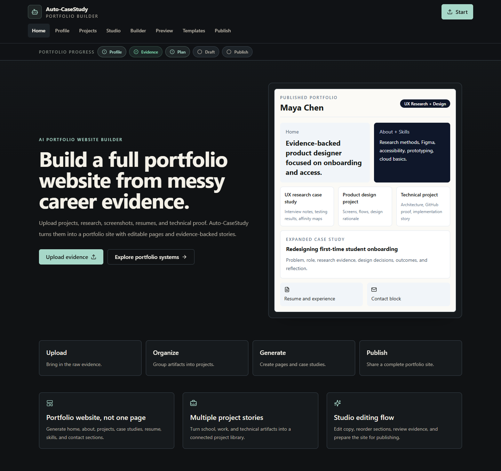
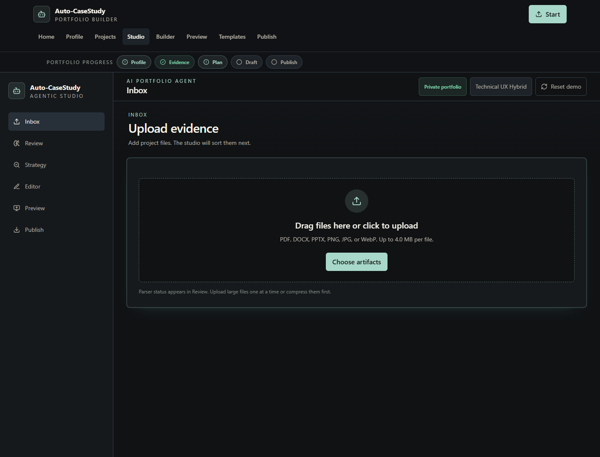
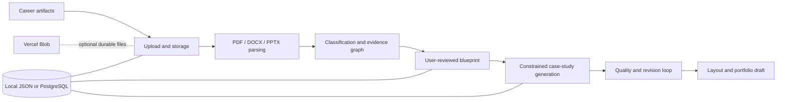

# Auto-CaseStudy

Auto-CaseStudy is an evidence-first portfolio studio that turns mixed career artifacts into structured, reviewable case studies. It is designed for HCI, UX, product, and technical professionals who need to explain not only what they built, but what evidence supports each claim.



<details>
<summary>View the evidence-ingestion studio</summary>



</details>

## What it demonstrates

- Real text extraction from PDF, DOCX, and PPTX artifacts
- Deterministic artifact classification, evidence tagging, and relationship mapping
- User-reviewed portfolio blueprints with revision history and audit events
- Evidence-constrained case-study generation that surfaces missing proof and unsupported metrics instead of inventing them
- Quality evaluation, section revisions, layout composition, and portfolio experience orchestration
- Local development storage plus PostgreSQL and Vercel Blob adapters for durable deployments
- Signed, HttpOnly workspace sessions and optional password protection for the studio

The current intelligence layer is deterministic and inspectable. It does **not** call an external LLM, and the repository does not claim otherwise.

## Architecture



## Technical decisions

- **Evidence before prose:** generated sections retain artifact IDs and provenance references.
- **Visible uncertainty:** blockers, missing sections, and unsupported metrics remain explicit.
- **Progressive persistence:** local JSON keeps development simple; PostgreSQL and Blob support durable hosted environments.
- **Fail-closed production storage:** serverless production does not silently treat ephemeral disk as durable storage.
- **Inspectable automation:** keyword rules provide a reliable baseline while leaving a clear boundary for a future model provider.

## Stack

Next.js 16, React 18, TypeScript, Prisma, PostgreSQL, Vercel Blob, Zustand, Tailwind CSS, Vitest, and GitHub Actions.

## Run locally

Requirements: Node.js 20.9 or newer.

```bash
npm ci
npm run dev
```

Open `http://localhost:3000`. Local development can run without external services and stores generated data under ignored `.data/` files.

## Verify

```bash
npm audit --audit-level=high
npm run lint
npm run typecheck
npm test
npm run build
```

The test suite covers document parsing, evidence classification, constrained generation, and signed workspace sessions. CI runs the same audit, lint, typecheck, test, and production-build gates.

## Optional configuration

No credentials belong in source control. Use local environment variables or managed deployment secrets.

- `DATABASE_URL` — PostgreSQL persistence
- `BLOB_READ_WRITE_TOKEN` — durable artifact storage on Vercel
- `AUTOCASESTUDY_WORKSPACE_SECRET` — workspace-session signing secret; required in production
- `AUTOCASESTUDY_STUDIO_PASSWORD` — optional Basic-auth protection for studio and API routes
- `AUTOCASESTUDY_ALLOW_PUBLIC_ARTIFACT_URLS` — explicit opt-in for public artifact URLs

Optional GitHub-managed Vercel previews run only when the repository variable `VERCEL_PREVIEWS_ENABLED` is set to `true` and the `VERCEL_TOKEN`, `VERCEL_ORG_ID`, and `VERCEL_PROJECT_ID` secrets are configured.

## Honest limitations

- Image artifacts are marked `Visual Parsing Pending`; vision extraction is not implemented.
- The signed workspace cookie protects integrity but is not a full account/login system. A real identity provider and authorization model are required for multi-user production use.
- Hosted one-click publishing is not implemented yet.
- Profile details entered in the browser may be stored in local storage; users should avoid entering sensitive personal data on shared devices.
- External LLM generation, Figma ingestion, repository ingestion, and transcript ingestion are future integrations.

See [docs/PORTFOLIO_READINESS.md](docs/PORTFOLIO_READINESS.md) for the security, privacy, testing, and publication assessment. Detailed product and engineering decisions remain in `docs/`.

## License

This repository is published for portfolio review. No open-source license is granted.

## Project status

This is a working engineering prototype with a broad end-to-end workflow, not a production SaaS claim. The strongest next milestone is authenticated multi-user persistence followed by a model-provider boundary that preserves the existing evidence and provenance guarantees.
