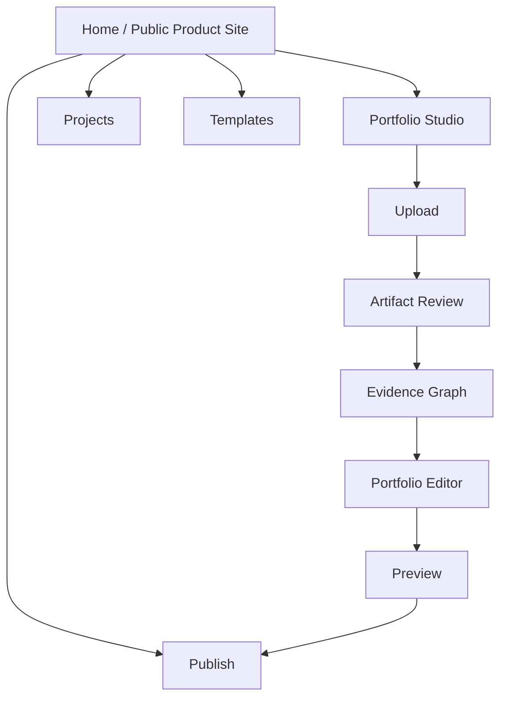
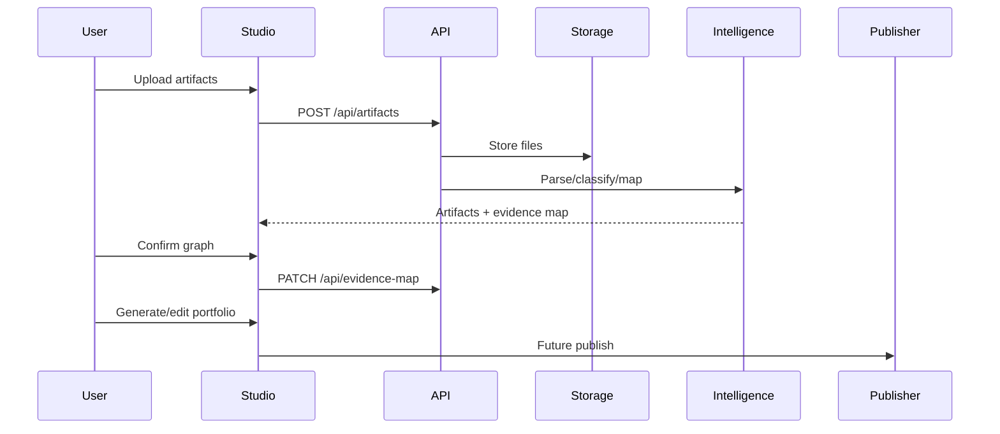

# App Flow Documentation

## Navigation Map

## Information Architecture

- Home: product promise, upload CTA, portfolio website preview, high-level workflow.
- Projects: project library and multiple case-study structure.
- Portfolio Studio: upload, artifact review, evidence graph, editor, preview, publish controls.
- Templates: persona-specific portfolio presentation systems.
- Publish: hosted website and export readiness.

## Portfolio Owner Flow

1. Land on Home.
2. Understand that Auto-CaseStudy creates a full portfolio website.
3. Click Start or Upload Evidence.
4. Enter Portfolio Studio.
5. Upload artifacts.
6. Review extracted content and classifications.
7. Confirm, reject, rename, or edit project clusters.
8. Generate portfolio pages and project stories.
9. Edit portfolio content and preview.
10. Publish hosted portfolio website.

## Public Portfolio Viewer Flow

1. Viewer opens a published portfolio URL.
2. Viewer scans home/profile.
3. Viewer opens project cards or case studies.
4. Viewer checks skills, resume, contact.
5. Viewer contacts or shares the portfolio owner.

## Admin Flow

MVP admin is not implemented.

Future admin:
1. Admin signs into organization.
2. Admin manages users, roles, storage, and billing.
3. Admin reviews audit logs and usage.
4. Admin configures templates and publishing policies.

## Upload-to-Publish Flow

## Authentication Flow

MVP has no real authentication.

Future:
1. Public visitor chooses Start.
2. User signs up or logs in.
3. User lands in studio workspace.
4. Workspace data is scoped to user/account.
5. Public published site uses a separate read-only route.

## Screen Transition Logic

- Home to Studio: start creation.
- Home to Projects: understand portfolio structure.
- Studio upload to Artifact Review: after upload or stored artifact sync.
- Artifact Review to Evidence Graph: after classification and relationship mapping.
- Evidence Graph to Editor: after user confirms enough project structure.
- Editor to Preview: after content edits.
- Preview to Publish: after accessibility/evidence readiness checks.

## Public vs Studio Experience

- Public site explains the product and portfolio output.
- Studio performs upload, review, editing, and publishing.
- Public published portfolios should eventually be separate from the product marketing site.

## Explicitly Excluded Flows

The Auto-CaseStudy repository should not include creator marketplace, fan engagement, fintech, booking, payout, or subscription flows. Those topics belong to separate exploratory projects and must not shape this platform's architecture.
