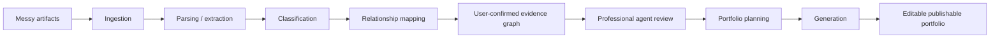

# Architecture Doctrine - Evidence First, Generation Second

Auto-CaseStudy is not a generic AI portfolio generator or template-based site builder.

The core product philosophy is:

> Generation is downstream of understanding.

The system must first prove that it can ingest, read, classify, organize, and understand messy professional evidence before attempting to generate portfolio pages.

## Why This Matters

The real value is not AI writing. The real value is reconstructing meaningful professional narratives from fragmented artifacts:

- PDFs
- screenshots
- research notes
- Figma exports
- presentations
- technical documents
- project files
- resumes
- certifications

If the system writes before it understands, it becomes a generic content generator. If it understands before it writes, it becomes professional evidence intelligence.

## Architecture Sequence

## Why The Evidence Graph Comes Before Generation

The system should think before it writes. It needs to understand:

- project boundaries
- timelines
- methods
- visuals
- evidence quality
- missing information
- audience needs
- recruiter relevance
- academic rigor
- technical credibility

Only after that should it decide what belongs on a homepage, what becomes a featured project, which images belong in a case study, or which claims are safe to publish.

## Specialized Agents Are Not Agent Theater

Specialized agents exist because different professional perspectives interpret the same evidence differently.

| Agent | Interprets Evidence For |
| --- | --- |
| UX Research Agent | Methodology, research quality, findings, limitations, evidence gaps. |
| UX Designer Agent | Visual hierarchy, flows, iteration, accessibility, media placement. |
| Recruiter Agent | Scanability, impact, role clarity, strongest projects, hiring signal. |
| Portfolio Strategist Agent | Site hierarchy, project order, narrative flow, audience fit. |
| Technical Agent | Architecture, implementation depth, systems thinking, feasibility. |

These agents must operate on the same trusted evidence graph. They should not hallucinate independently.

## Guardrails

Auto-CaseStudy affects professional identity and career opportunities. Therefore:

- Do not invent unsupported claims.
- Do not invent fake metrics.
- Do not invent research findings.
- Do not invent citations.
- Do not invent outcomes.
- Ground important statements in evidence, provenance, or explicit user confirmation.
- Ask follow-up questions when information is missing.
- Separate extracted evidence from inferred strategy.

## Portfolio Reference Intelligence

Portfolio references are not collected for copying. They are collected to build a structured understanding of:

- portfolio archetypes
- storytelling structures
- recruiter-readable layouts
- media hierarchy
- research-heavy vs visual-heavy patterns
- technical depth signals
- strong and weak project page patterns

References guide agents. They do not replace user evidence and they must not be copied directly.

## Product Target

The final output target is a fully publishable professional portfolio website with:

- structured pages
- project index
- nested case-study detail pages
- responsive layouts
- media placement
- provenance-aware claims
- recruiter-ready storytelling
- user-editable sections
- publish/export flow
