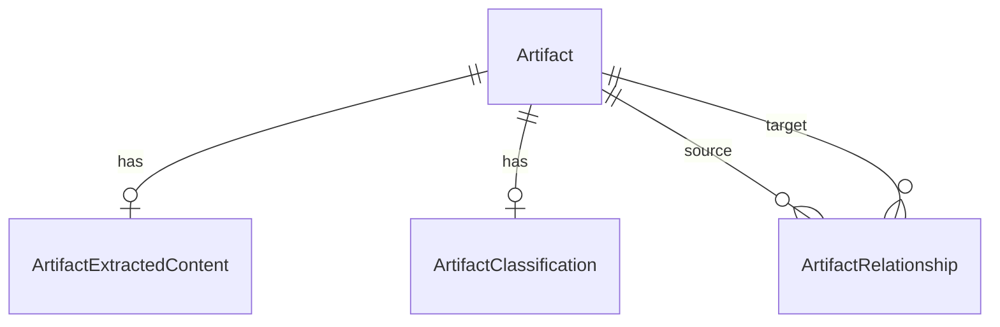

# Backend Schema Documentation

## Current Prisma Models

## Artifact

- `id`: stable artifact id.
- `userId`: owner id; currently demo user.
- `fileName`: original file name.
- `fileType`: normalized product file type.
- `mimeType`: uploaded MIME type.
- `sizeBytes`: file size.
- `storageUrl`: local or durable storage URL.
- `storageKey`: local path key or blob key.
- `status`: upload/parse state.
- `parserError`: parser failure message.
- `uploadedAt`, `updatedAt`: lifecycle timestamps.

## ArtifactExtractedContent

- `id`
- `artifactId`
- `text`
- `parser`
- `parserVersion`
- `createdAt`

Stores raw extracted text separately from metadata.

## ArtifactClassification

- `id`
- `artifactId`
- `classification`
- `confidenceScore`
- `projectName`
- `courseOrJob`
- `tools`
- `methods`
- `dates`
- `outcomes`
- `tags`
- `classifier`
- `classifierVersion`
- `createdAt`

Stores deterministic classification output. Future AI classifications must keep version and source traceability.

## ProjectCluster

- `id`
- `label`
- `artifactIds`
- `reasons`
- `confidenceScore`
- `status`: Suggested, Confirmed, Rejected, Needs Review.
- `createdAt`

Represents a project grouping candidate or user-confirmed evidence cluster.

## ArtifactRelationship

- `id`
- `sourceArtifactId`
- `targetArtifactId`
- `type`
- `reason`
- `confidenceScore`
- `status`
- `createdAt`

Represents evidence relationships such as same project, same course/job, same tool, timeline connection, and supporting evidence.

## Future User Models

- User: identity, email, name, specialization, career goals.
- Account/Organization: plan, team, institution, billing owner.
- Membership: user role and permissions.
- Session/AuthAccount: provider-linked authentication.

## Future Portfolio and Project Models

- Portfolio: owner, slug, title, theme, status, published URL.
- PortfolioPage: home, about, projects, resume, skills, contact, custom pages.
- Project: title, type, date range, role, summary, audience mode.
- CaseStudy: project, sections, layout, source links, status.
- CaseStudySection: title, content, order, locked state, evidence links.
- Skill: label, category, evidence links.
- ExperienceItem: role, company, dates, bullets, related projects.
- Certification: title, issuer, date, artifact link.

## Media Models

- MediaAsset: image/video/document preview, alt text, caption, source artifact.
- MediaPlacement: selected section/page, order, size, crop/focal data.
- Thumbnail: generated preview variants.

## Event Models

- ArtifactUploaded
- ArtifactParsed
- ArtifactClassified
- RelationshipSuggested
- ClusterConfirmed
- PortfolioGenerated
- PortfolioPublished
- ClaimSourceMissing

Events should include actor, target entity, timestamps, payload version, and request id.

## Explicitly Excluded Data Domains

Do not add marketplace, fintech, booking, payout, fan engagement, celebrity subscription, or mobile money schemas to this repository.

Auto-CaseStudy data models must remain focused on portfolio website generation, artifact evidence, projects, case studies, publishing, permissions, and auditability.

## Permission Structures

Future roles:
- Owner: full control.
- Editor: can upload, edit, and generate.
- Reviewer: can comment and suggest.
- Viewer: read-only access.
- Admin: organization management.

Every row should be scoped by user or organization ownership.

## Audit Logging Structures

Future AuditLog:
- `id`
- `actorId`
- `action`
- `entityType`
- `entityId`
- `before`
- `after`
- `source`: user, system, AI, import.
- `createdAt`

Audit logs are required for AI suggestions, user overrides, evidence graph changes, and publishing.
