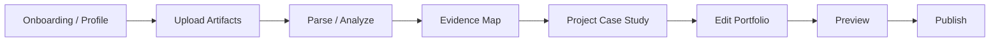

# Startup Quality System

Auto-CaseStudy must be treated as a real startup product, not a quick app demo.

## Protected Product Promise

Upload messy career evidence. The agent reconstructs polished, evidence-backed case studies and portfolio pages the user can edit and publish.

Every feature, page, button, API, and design choice should support that promise.

## Operating Principles

- Protect the core workflow before adding broad page-builder features.
- Do not ship fake AI claims. Simulated intelligence must be labeled by behavior and never pretend to parse or understand more than it does.
- No disconnected screens. Every view should move the user closer to an editable, publishable portfolio.
- Every button either works, explains a coming-soon state, or is removed.
- Evidence and provenance are product-critical, not decorative.
- Private user artifacts must never be publicly exposed by default.
- Design quality and security quality are both MVP requirements.

## Required Focus Areas

### Security

- Secure file upload handling.
- File size and file type limits.
- Authentication and access control before production private use.
- Safe file storage with private defaults.
- Environment variables protected from client exposure.
- No public artifact URLs unless the user intentionally publishes them.
- Defensive handling of malformed files, unexpected MIME types, and parser failures.

### Backend Quality

- Durable storage for files.
- Clean database schema for artifacts, portfolios, projects, pages, jobs, evidence links, and audit logs.
- Reliable API routes with clear request/response contracts.
- Clear error handling and user-visible failure states.
- Scalable parsing pipeline with job status tracking.
- Upload, parsing, classification, relationship mapping, generation, and publish statuses.

### Product Faithfulness

- The app must stay focused on portfolio generation from evidence.
- No marketplace, fintech, booking, creator payout, subscription, or unrelated platform infrastructure.
- Global pages define the professional identity.
- Projects own uploaded project artifacts.
- Case Study Detail pages live under Projects.
- Preview must reflect the generated portfolio site, not only an internal editor state.

### Page-To-Page Logic

Target flow:

### Feasibility Gate

Before any major feature, answer:

- Can it actually work technically?
- What data does it need?
- Where is that data stored?
- What happens if upload, parsing, generation, or publishing fails?
- Is this needed for the MVP workflow?
- Does it strengthen the agentic evidence-to-portfolio promise?

### Design System Discipline

- Use consistent colors, spacing, typography, hierarchy, and component patterns.
- Keep dark/light mode feasible by using semantic tokens.
- Preserve visible focus states and keyboard navigation.
- Design mobile layouts intentionally, not as compressed desktop screens.
- Avoid dense text-heavy screens; reveal complexity progressively.
- Reuse components before inventing new UI surfaces.

### Evidence And Provenance

- Generated claims should link back to uploaded artifacts whenever possible.
- Unsupported claims must be marked instead of invented.
- Missing evidence should trigger a gap or follow-up prompt.
- The agent should distinguish extracted evidence from inferred strategy.

## Startup Team Roles

These roles may be simulated at first, but every major step should be reviewed through these lenses.

| Role | Ownership |
| --- | --- |
| Product Lead | Product direction, MVP scope, roadmap, and feature priority. |
| UX/Product Designer | User flows, page structure, design system, interaction quality, and visual consistency. |
| Backend Engineer | Database, API routes, storage, parsing pipeline, security, and reliability. |
| Frontend Engineer | Page implementation, components, responsive UI, buttons, states, and integration. |
| AI/Agent Engineer | Parsing logic, classification, evidence mapping, provenance, reasoning, and generation rules. |
| QA/Test Lead | Workflow testing, broken button checks, edge cases, upload/parsing/generation/edit/publish verification. |
| Security/Privacy Reviewer | File safety, access control, private data handling, environment variables, and abuse risks. |
| DevOps/Deployment Lead | GitHub, Vercel, environment setup, CI, preview deployments, database setup, logs, and production readiness. |
| Content/Portfolio Strategist | Portfolio quality, case-study structure, recruiter readability, HCI/UX language, and professional tone. |

## Major Step Documentation Standard

Every major step must include:

- High-level diagram/map.
- Tech stack used.
- What each part does.
- How to reproduce it.
- Security/privacy notes.
- QA checklist.
- Feasibility notes.
- What comes next.

Use `docs/STEP_TEMPLATE.md` for new implementation milestones.
