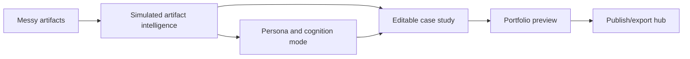

# Step 001: Agentic Portfolio Studio Foundation

## High-Level Map



## Tech Stack Used

- Frontend: Next.js, React, TypeScript, Tailwind CSS
- Interaction: dnd-kit, lucide-react
- State: Zustand with localStorage persistence
- Intelligence: local simulated classification, persona inference, gap detection, and section generation
- Deployment prep: Vercel config, GitHub Actions CI, optional Vercel preview workflow

## What Each Part Does

- Artifact ingestion UI accepts messy evidence and sends filenames into the simulated intelligence layer.
- Intelligence layer classifies artifacts, infers a persona, generates editable sections, and detects evidence gaps.
- Cognition panel explains how specialized professional agents should interpret the same evidence differently.
- Editor lets users reorder sections, lock user edits, edit copy, and apply AI-style prompt revisions.
- Preview and export panels show the direction for a hostable portfolio story with provenance.

## How To Reproduce It

```bash
npm install
npm run build
npm run dev
```

Open `http://localhost:3000`.

For production-style local verification:

```bash
npm run build
npm run start
```

## What Comes Next

- Add real parsing for PDFs, DOCX files, slides, images, and pasted links.
- Replace filename-based understanding with extracted artifact metadata and text.
- Expand provenance from a simulated graph into real source-to-claim relationships.
- Keep the wedge focused on one editable case study before broad portfolio-builder scope.
