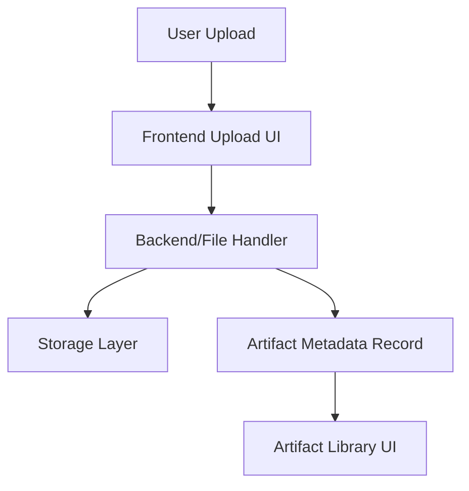

# Step 002: Real Artifact Ingestion Skeleton

## High-Level Map



## Tech Stack Used

- Frontend: Next.js upload input inside the existing React studio UI
- Backend/file handler: Next.js App Router API route at `/api/artifacts`
- Local storage: `.data/uploads/` for files and `.data/artifacts.json` for the manifest
- Metadata: JSON artifact records compatible with the current local state model
- Future storage: S3 or equivalent object storage
- Future metadata database: PostgreSQL

## What Each Part Does

- Frontend upload UI accepts PDF, DOCX, image, and slide files.
- API route validates supported file types, writes files to local disk, and creates metadata records.
- Storage layer keeps original uploaded files under `.data/uploads/`.
- Manifest stores basic artifact metadata: filename, MIME type, size, upload time, storage path, kind, and processing status.
- Artifact library UI displays uploaded records as `Pending Parsing` instead of pretending the app understands them.

## How To Reproduce It

```bash
npm install
npm run dev
```

Open `http://localhost:3000`, choose **Add files**, and upload a supported file:

- `.pdf`
- `.doc` / `.docx`
- `.ppt` / `.pptx`
- `.png` / `.jpg` / `.jpeg` / `.webp` / `.gif`

Uploaded files are stored locally:

```text
.data/uploads/
.data/artifacts.json
```

For production-style verification:

```bash
npm run build
npm run start
```

## What Comes Next

- Add basic text extraction for PDFs and DOCX files.
- Add image metadata and thumbnail generation.
- Move local `.data` storage behind a replaceable storage interface before adding S3.
- Add project/course grouping before advanced agent reasoning.
- Keep Google Drive, Figma, GitHub, and full parsing out of scope until the upload pipe is stable.

## Deployment Note

The current `.data` storage layer is intentionally local-only. It is useful for proving the pipe, but it is not durable on Vercel serverless deployments. Before real preview users upload important files, replace local writes with object storage such as S3, Vercel Blob, or another durable file store.
