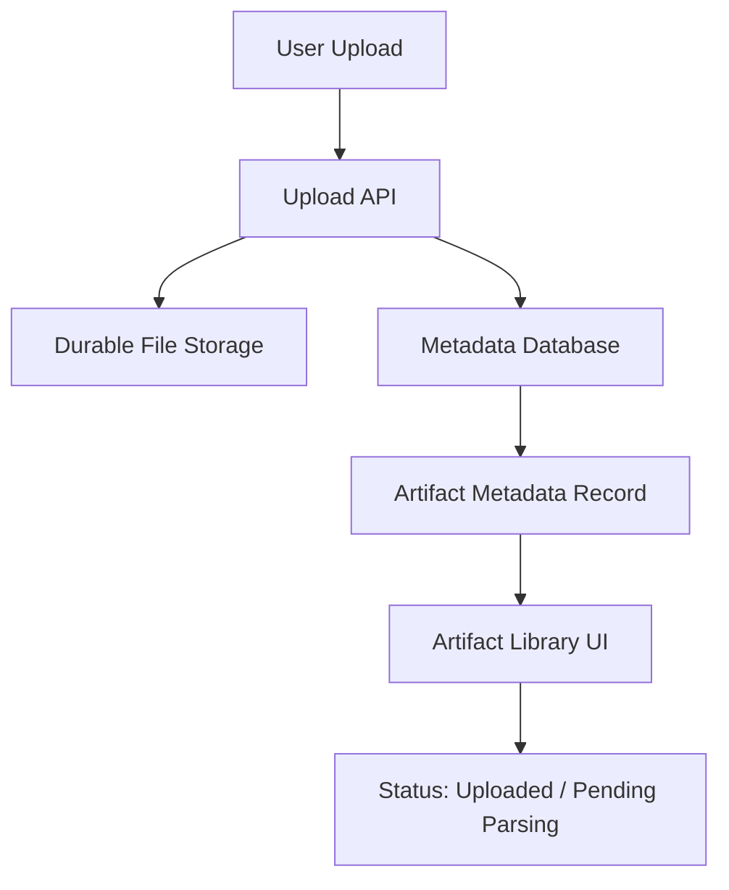

# Step 003: Durable Storage + Metadata Foundation

## High-Level Map



## Tech Stack Used

- Frontend: existing Next.js upload component
- API: Next.js App Router route at `/api/artifacts`
- Durable file storage: Vercel Blob when `BLOB_READ_WRITE_TOKEN` is configured
- Metadata database: PostgreSQL via Prisma when `DATABASE_URL` is configured
- Dev fallback: local `.data/uploads/` and `.data/artifacts.json`

## What Each Part Does

- Upload API validates supported file types and creates one artifact record per file.
- Storage adapter writes to Vercel Blob in production-capable environments.
- Local storage remains available only as a development fallback.
- Repository adapter writes metadata to PostgreSQL through Prisma when configured.
- Local JSON manifest remains available only as a development fallback.
- Artifact records keep `Pending Parsing` status. No parsing or AI understanding runs in this step.

## Metadata Table

`Artifact`

- `id`
- `userId`
- `fileName`
- `fileType`
- `mimeType`
- `sizeBytes`
- `storageUrl`
- `storageKey`
- `status`
- `uploadedAt`
- `updatedAt`

## How To Reproduce It

Local fallback:

```bash
npm install
npm run db:generate
npm run dev
```

Open `http://localhost:3000`, upload a supported file, and inspect:

```text
.data/uploads/
.data/artifacts.json
```

Production-style configuration:

```bash
DATABASE_URL="postgresql://..."
BLOB_READ_WRITE_TOKEN="vercel_blob_rw_..."
AUTOCASESTUDY_DEFAULT_USER_ID="demo-user"
npm run db:generate
npm run db:push
npm run build
```

## What Comes Next

- Add project/course grouping to the metadata model.
- Add basic parsers after storage and metadata are stable.
- Keep Google Drive, Figma, GitHub, and full AI parsing out of scope.
- Replace `AUTOCASESTUDY_DEFAULT_USER_ID` with real auth once accounts exist.
