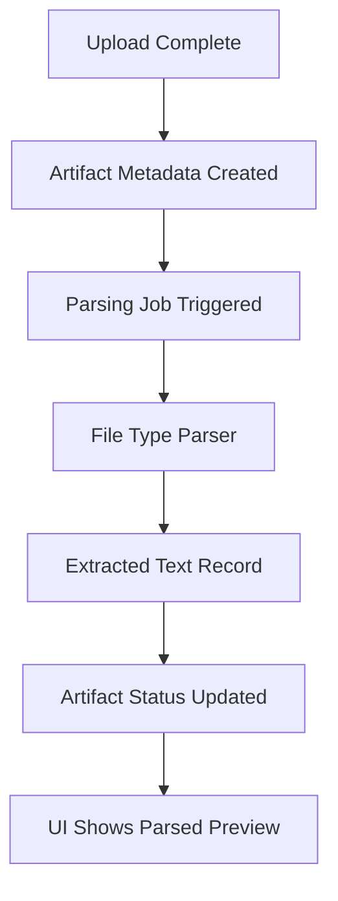

# Step 004: Parsing Queue + Extracted Text Layer

## High-Level Map



## Tech Stack Used

- PDF extraction: `pdf-parse`
- DOCX extraction: `mammoth`
- PPTX extraction: `jszip` reading slide XML text nodes
- Images: no visual parsing yet; status becomes `Visual Parsing Pending`
- Metadata database: Prisma model `Artifact`
- Extracted text store: Prisma model `ArtifactExtractedContent`
- Dev fallback: local `.data/artifacts.json` includes extracted content in artifact records

## What Each Part Does

- Upload API stores the file and creates a metadata record.
- Parser job runs immediately inside the API route for now.
- File type parser extracts raw text for PDF, DOCX, and PPTX.
- Images are deliberately not parsed yet.
- Extracted text is stored separately from artifact metadata.
- Artifact status becomes `Parsed`, `Failed`, or `Visual Parsing Pending`.
- Artifact Library UI shows parser status, parser name, extracted preview, or failure reason.

## Status Flow

- `Uploaded`
- `Parsing`
- `Parsed`
- `Failed`
- `Visual Parsing Pending`

The current implementation performs parsing synchronously after upload. A real background queue should replace this once uploads become large or multi-user.

## How To Reproduce It

```bash
npm install
npm run db:generate
npm run dev
```

Upload a supported file:

- `.pdf`
- `.docx`
- `.pptx`
- image files such as `.png` or `.jpg`

Expected results:

- PDF/DOCX/PPTX: status `Parsed` when text extraction succeeds.
- Image: status `Visual Parsing Pending`.
- Unsupported or unreadable content: status `Failed` with parser error.

Production-style database setup:

```bash
npm run db:generate
npm run db:push
```

## What Comes Next

- Move parser execution to a background job queue.
- Add parser result confidence and page/slide-level provenance.
- Add image OCR or multimodal visual extraction later.
- Do not add agent reasoning until extraction quality is reliable.
