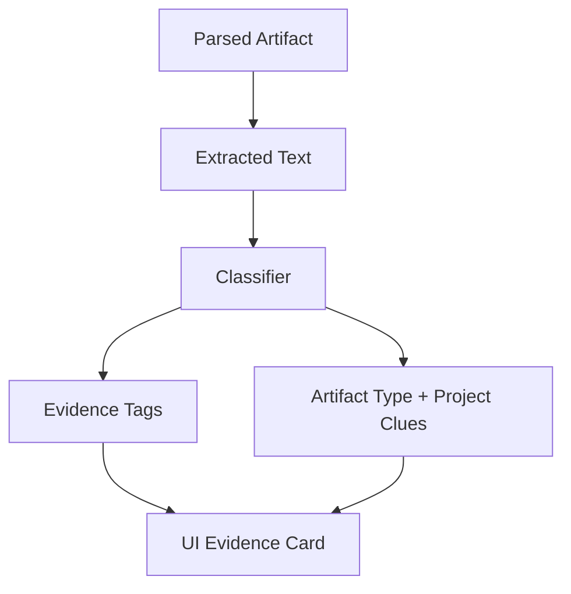

# Step 005: Artifact Classification + Evidence Tags

## High-Level Map



## Tech Stack Used

- Classifier: deterministic keyword/rule-based TypeScript function
- Source data: filename, MIME type, file type, and extracted text when available
- Metadata storage: Prisma model `ArtifactClassification`
- Local fallback: classification stored inside `.data/artifacts.json`
- UI: evidence tags shown inside the artifact library table

## What Each Part Does

- Classifier labels artifacts as one of:
  `research notes`, `presentation`, `design artifact`, `resume/profile`, `project report`, `technical documentation`, `certificate`, or `unknown`.
- Evidence tag extractor pulls simple clues:
  project name, course/job/source, tools mentioned, methods mentioned, dates, and possible outcomes.
- Classification is stored separately from raw extracted text.
- UI shows classification confidence and tags without calling it “understanding.”

## How To Reproduce It

```bash
npm install
npm run db:generate
npm run dev
```

Upload a PDF, DOCX, PPTX, or image. After upload:

- Parsed text appears when extraction succeeds.
- Classification card appears with artifact type and evidence tags.
- Images can still be classified from filename/metadata, but visual understanding is not active.

Production-style database setup:

```bash
npm run db:generate
npm run db:push
```

## What Comes Next

- Add artifact grouping by project/course.
- Add relationship mapping across artifacts.
- Keep LLM classification behind a future explicit environment flag.
- Do not call this “understanding” until multiple artifacts are connected and reconciled.
