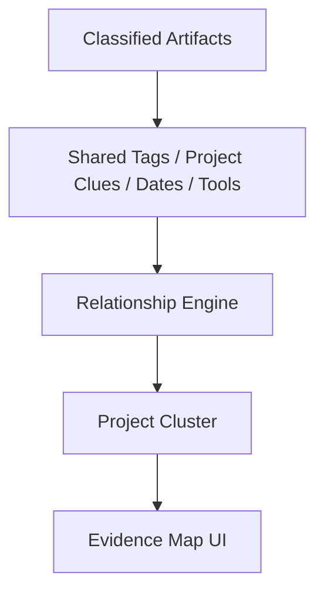

# Step 006: Artifact Relationship Mapping

## High-Level Map



## Tech Stack Used

- Relationship engine: deterministic TypeScript matching rules
- Inputs: artifact classifications, project names, course/job clues, tools, dates, and artifact types
- Data models: Prisma `ProjectCluster` and `ArtifactRelationship`
- UI: project cluster review panel with confirm/reject controls
- API: `/api/artifacts` returns `evidenceMap`; `/api/evidence-map` accepts review status updates

## What Each Part Does

- Relationship engine groups artifacts that likely belong to the same project.
- Relationship types include:
  `same project`, `same course/job`, `same tool`, `possible timeline connection`, and `supporting evidence`.
- Project clusters include related artifacts, grouping reasons, confidence score, and review status.
- UI shows cluster candidates and lets the user confirm or reject groupings.
- This is structured relationship mapping, not agent reasoning or narrative generation.

## How To Reproduce It

```bash
npm install
npm run db:generate
npm run dev
```

Upload multiple artifacts with similar names, tools, methods, dates, or course/project clues. Then inspect the **Project cluster review** panel.

For production-style database setup:

```bash
npm run db:generate
npm run db:push
```

## What Comes Next

- Persist confirmed/rejected cluster decisions in the database.
- Add project/course grouping as first-class user-editable objects.
- Add relationship provenance at the page/slide/paragraph level.
- Do not generate narratives until cluster review and relationship quality are trustworthy.
