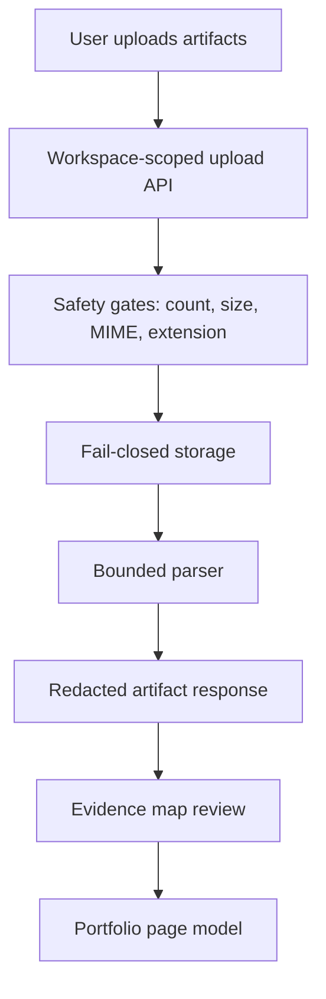

# Step 007.10 - Production Readiness Stress Fixes

## High-Level Map

## Tech Stack Used

- Next.js middleware for temporary studio/API access gating.
- Next.js route handlers for upload and evidence-map actions.
- Prisma schema for the portfolio-generation data spine.
- Vercel Blob/local storage with fail-closed production behavior.
- Local deterministic parsers with workload caps.
- React/Tailwind studio UI with real drag-and-drop upload affordances.

## What Each Part Does

- `src/middleware.ts` protects `/studio`, `/api/artifacts`, and `/api/evidence-map` when `AUTOCASESTUDY_STUDIO_PASSWORD` is configured.
- `src/app/api/artifacts/route.ts` scopes artifact reads/writes to a browser workspace, rejects unsafe upload batches, redacts extracted text in API responses, and avoids synchronous parsing for large files.
- `src/lib/server/storage.ts` blocks public Vercel Blob artifact exposure unless explicitly allowed for demo environments.
- `src/lib/server/parsers.ts` caps extracted text, PPTX slide count, and slide XML processing.
- `prisma/schema.prisma` now includes the MVP production spine: users, workspaces, portfolios, pages, projects, case studies, evidence links, parser jobs, publish records, and audit logs.
- `src/components/portfolio-studio.tsx` adds real drag-and-drop handling, upload success/error feedback, a portfolio page tree, workspace scoping, and locked-section behavior that matches the UI label.

## How To Reproduce

1. Copy `.env.example` to `.env.local`.
2. Leave `BLOB_READ_WRITE_TOKEN` empty for local `.data` uploads, or configure private production storage before enabling Vercel Blob.
3. Run `npm run db:generate` after schema changes.
4. Run `npm run build`.
5. Open `/studio`, upload PDF/DOCX/PPTX/image files, and verify:
   - unsupported files are rejected,
   - oversized files are rejected,
   - drag-and-drop works,
   - uploaded artifacts appear in the workspace,
   - extracted text previews are short and redacted,
   - evidence-map decisions are workspace-scoped.

## What Comes Next

Step 008 should not be broad agent reasoning yet. The next safe move is a real parser job table/API flow:

1. Create parser jobs on upload.
2. Process jobs asynchronously.
3. Persist parser events and failures.
4. Convert confirmed clusters into first-class `Project` records.
5. Generate a first real `Portfolio` and `PortfolioPage` draft from confirmed evidence.

## Security Notes

- Source artifacts are sensitive by default.
- Public artifact URLs are demo-only and require explicit opt-in.
- Basic Auth is not final authentication; it is a temporary production preview gate.
- Real auth, signed storage URLs, virus scanning, rate limiting, and background jobs remain required before open beta.
