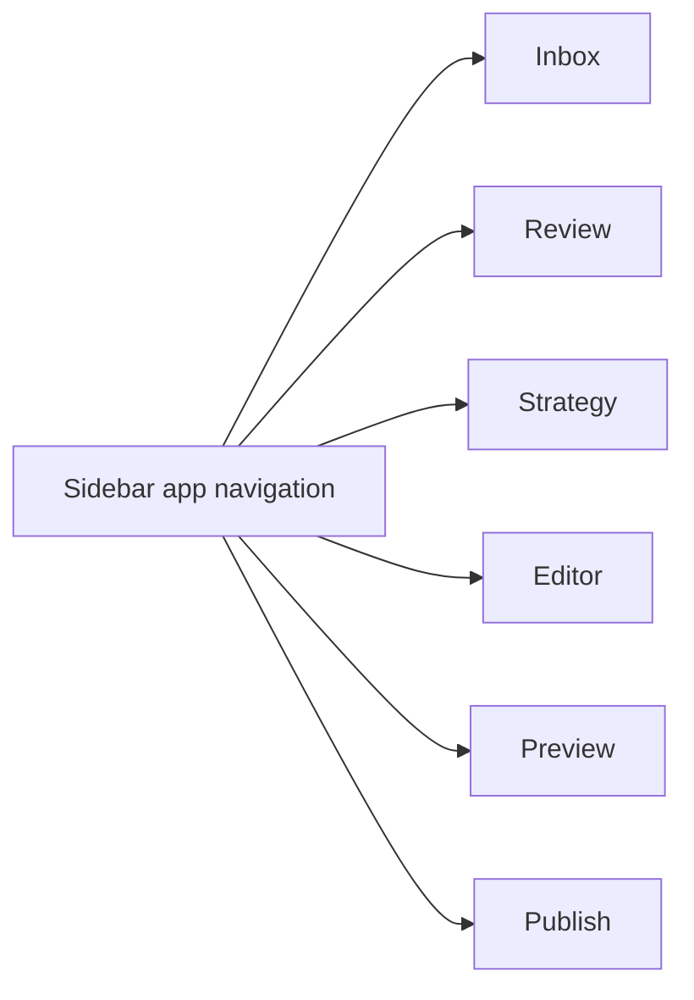

# Step 007.11 - Studio Navigation Simplification

## High-Level Map

## Tech Stack Used

- Next.js App Router
- React local state for active studio view
- Tailwind CSS for selected states and responsive mobile tabs
- Existing upload, evidence, editor, preview, and publish components reused as focused views

## What Each Part Does

- `activeView` turns the studio from a one-page scroll into a mode-based app workspace.
- `Sidebar` now uses buttons with selected state instead of anchor links.
- `MobileViewTabs` gives small screens the same app navigation model.
- `ViewShell` creates a consistent compact title area for each workspace mode.
- The initial Inbox view focuses on uploading evidence and removes hero/marketing explanation from the app surface.
- Review, Strategy, Editor, Preview, and Publish each expose one primary job instead of showing every system panel at once.

## How To Reproduce

1. Run a production build.
2. Start the app and open `/studio`.
3. Click Sidebar items: Inbox, Review, Strategy, Editor, Preview, Publish.
4. Confirm the page content switches in place instead of scrolling down a long page.
5. Confirm the initial view does not show the old hero, workflow explainer, or stacked dashboard sections.

## What Comes Next

- Add true nested routes or URL state for each studio view.
- Make Review use card-based artifact triage instead of a dense table.
- Make Preview the actual generated portfolio canvas.
- Turn Publish into a real deployable static portfolio package.
