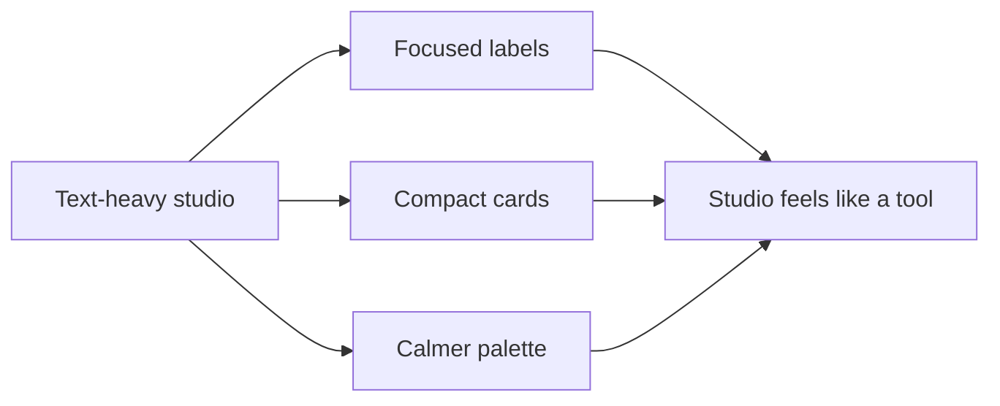

# Step 007.12 - Visual Density and Color Reduction

## High-Level Map

## Tech Stack Used

- Tailwind design tokens in `tailwind.config.ts`
- Global surface treatment in `src/app/globals.css`
- Studio component cleanup in `src/components/portfolio-studio.tsx`

## What Changed

- Reduced view headings and helper text.
- Removed unused explainer components from the studio file.
- Replaced the dense artifact table with compact artifact cards.
- Shortened labels in page structure, evidence trust, editor, preview, and publish panels.
- Shifted the dark palette away from bright blue-purple toward calmer charcoal, warm ink, and muted mint accents.

## Design Rationale

The studio should feel calm on the surface and intelligent underneath. Users should not have to read the architecture to trust the system. The interface now prioritizes:

- one job per view,
- shorter labels,
- fewer paragraphs,
- softer contrast,
- less dashboard density,
- clearer artifact review.

## What Comes Next

- Convert remaining evidence and publish panels into inspector drawers.
- Add page-level preview/canvas editing.
- Replace text-heavy case study cards with visual section blocks and media placement.

## Follow-Up Applied

- The top bar now shows persona as read-only status; persona editing lives in Strategy.
- Repeated child headers were removed from Inbox, Preview, and Publish.
- Editor now uses outline, story canvas, and evidence inspector surfaces instead of one stacked form.
