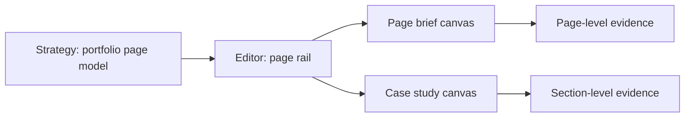

# Step 007.14 - Page-Aware Portfolio Editor

## Why This Step Exists

The Strategy view showed a complete portfolio site map, but the Editor only exposed case-study sections. That made the product feel inconsistent: users could see Home, About, Projects, Resume, Skills, and Contact in Strategy, but could not edit those outputs.

## High-Level Map

## Tech Stack Used

- Next.js app UI
- React state for local page draft editing
- Existing Zustand portfolio state for artifacts, persona, and case-study sections
- Existing dnd-kit section reordering for the case-study canvas
- Existing Tailwind design tokens and lucide icons

## What Each Part Does

- `getPortfolioPages()` creates one shared page model for Strategy and Editor.
- Strategy still shows the full site map.
- Editor now shows a page rail with Home, About, Projects, Case Studies, Resume, Skills, and Contact.
- Non-case-study pages open a lightweight page brief editor with purpose, sources, and editable draft copy.
- Case Studies keeps the deeper section canvas with drag reorder, lock state, prompt editing, and section evidence.
- The evidence inspector now works for both selected pages and selected case-study sections.

## How To Reproduce It

1. Open `/studio`.
2. Go to Strategy and confirm the portfolio site map appears.
3. Go to Editor.
4. Confirm the same page model appears in the page rail.
5. Select About, Projects, Resume, Skills, or Contact and confirm a page canvas appears.
6. Select Case Studies and confirm the section-based case-study editor appears.

## What Comes Next

- Persist page drafts in the store instead of temporary component state.
- Convert page briefs into structured blocks.
- Add visual/media slots per page.
- Connect Preview to the selected page model.
- Add claim-level evidence linking inside each generated portfolio page.
