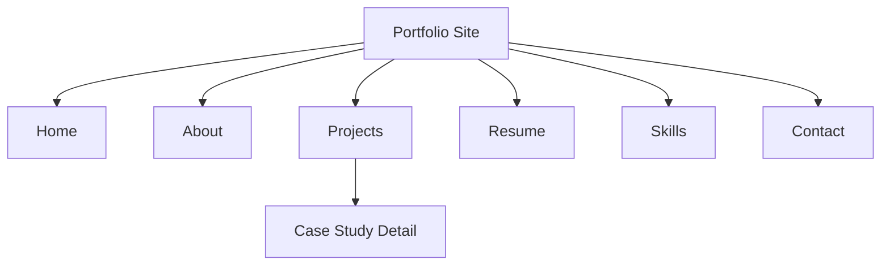

# Step 007.15 - Portfolio Template Contract

## Product Decision

Case studies belong inside Projects. The public portfolio may show a Projects page in the main navigation, and each serious project can open a case-study detail page. The editor should model that relationship instead of treating case studies as a disconnected top-level output.

## Portfolio Page Requirements

## What Each Page Must Contain

- Home: role headline, value proposition, proof snapshot, featured projects, primary action, hero visual.
- About: professional bio, design/research philosophy, working style, credibility proof, portrait or process media.
- Projects: project cards, thumbnails, role/timeline/methods, filters, and links into case-study detail pages.
- Case Study Detail: problem, role, process timeline, research evidence, design/media, outcome, reflection, and claim traceability.
- Resume: experience timeline, education, certifications, resume packet, and download action.
- Skills: method groups, tool groups, technical credibility, and evidence-backed claims.
- Contact: email/social actions, resume handoff, availability note, and share preview.

## Editor Changes

- Portfolio pages now carry `mustHave` requirements and `mediaPlan` slots.
- Page canvases show template structure, media slots, and agent recommendations.
- Case Study Detail is marked as nested under Projects.
- The current implementation remains a template contract, not a full visual page builder yet.

## Future Agent Behavior

The agent should use this contract to:

- Auto-fill page copy from artifacts.
- Suggest or place uploaded images, prototype embeds, videos, diagrams, and generated visuals.
- Ask for missing media when a page needs stronger visual storytelling.
- Mark unsupported claims before publishing.
- Generate dynamic portfolio sections that can later become real editable blocks.
