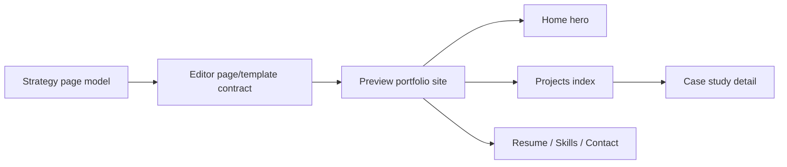

# Step 007.16 - Portfolio-Faithful Preview

## Why This Step Exists

The Preview view was still showing a list of case-study sections. That was no longer faithful to the product contract because Strategy and Editor now model a full portfolio website.

## High-Level Map

## What Changed

- Preview now presents a portfolio-site surface instead of a simple case-study list.
- The preview includes navigation for top-level pages.
- Projects is shown as the project index.
- Case Study Detail is shown as nested under Projects.
- Resume, Skills, and Contact are represented as public-facing page blocks.
- Media placeholders show where the agent can attach uploaded images, embeds, videos, motion, or generated visuals.
- Evidence counts remain visible so the preview stays provenance-aware.

## How To Reproduce It

1. Open `/studio`.
2. Go to Preview.
3. Confirm the preview shows portfolio navigation, hero area, project cards, nested case-study detail, and supporting pages.
4. Switch persona/audience/theme in Strategy and return to Preview.
5. Confirm the preview still reflects the portfolio model rather than only case-study sections.

## What Comes Next

- Make preview page blocks clickable.
- Add responsive desktop/mobile preview modes.
- Let users switch between Home, About, Projects, Case Study Detail, Resume, Skills, and Contact preview states.
- Render real uploaded media once artifact image URLs are available.
