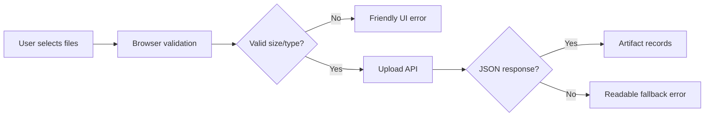

# Step 007.17 - Upload Error Hardening

## Why This Step Exists

Users saw `Unexpected token 'R', "Request En"... is not valid JSON` after uploading a file. That means the hosted platform returned a non-JSON error, likely `Request Entity Too Large`, before the app could return its normal API response.

## High-Level Map

## Tech Stack Used

- Next.js client component upload flow.
- Next.js API route for artifact ingestion.
- Existing local/Vercel storage abstraction.

## What Each Part Does

- Browser validation blocks unsupported extensions, too many files, oversized files, and oversized batches before upload.
- API defaults now match the hosted MVP upload limit.
- Frontend response parsing handles both JSON and plain-text server errors.
- The upload card now displays the size limit and tells users to upload large files one at a time or compress them.

## How To Reproduce It

1. Open `/studio`.
2. Go to Inbox.
3. Upload a file larger than the hosted MVP limit.
4. Confirm the UI shows a friendly size message instead of a JSON parsing error.
5. Upload a valid small PDF, DOCX, PPTX, PNG, JPG, or WebP and confirm it appears in Review.

## Security / Privacy Notes

- The browser-side limit reduces accidental oversized uploads before private files leave the device.
- Server-side limits remain authoritative.
- Unsupported file types are rejected before storage.
- Private artifact URLs remain sanitized before returning to the client.

## QA Checklist

- Build passes.
- Oversized upload shows a clear error.
- Unsupported file extension shows a clear error.
- Empty upload remains ignored.
- Valid supported file still uploads.
- Non-JSON server errors no longer crash the UI parser.

## Feasibility Notes

- Vercel request payload limits can reject bodies before app code runs.
- This step does not replace durable background upload/storage for large files.
- Future larger uploads should use direct-to-blob/S3 signed uploads.

## What Comes Next

- Add direct-to-blob uploads for larger files.
- Show per-file upload status.
- Add file compression guidance for images and slides.
- Add parser queue retry states.
