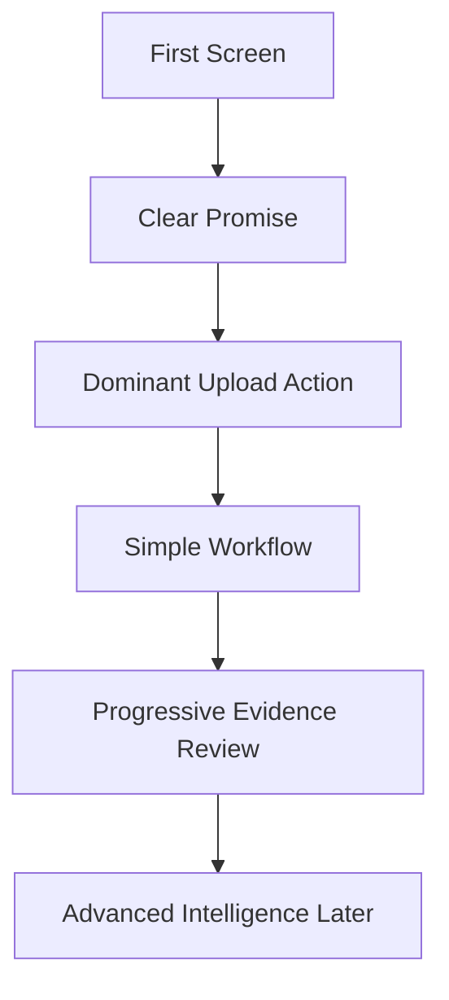

# Step 007.5: UI Direction Correction

## High-Level Map

## Tech Stack Used

- Next.js and React component structure.
- Tailwind CSS for layout, hierarchy, and responsive spacing.
- Lucide icons for primary actions.
- Existing upload, parsing, classification, and evidence graph APIs.

## What Each Part Does

- Hero now answers what the product does in one clear promise.
- Upload panel is the primary action and visual center.
- Workflow preview is reduced to Upload, Understand, Organize, Generate, Publish.
- Internal metrics are renamed toward evidence coverage and source signals.
- Cognition, provenance, strategy, preview, and export remain available but are no longer the first thing the user must process.

## How To Reproduce It

1. Run `npm run dev`.
2. Open `http://localhost:3000`.
3. Confirm the first screen leads with the promise and upload action.
4. Scroll to see artifact review, evidence graph, cognition modes, editor, preview, and publish surfaces.

## What Comes Next

Step 008 can now begin constrained agent reasoning from the user-confirmed evidence graph. The agent should stay grounded in confirmed clusters, source signals, and evidence coverage.
