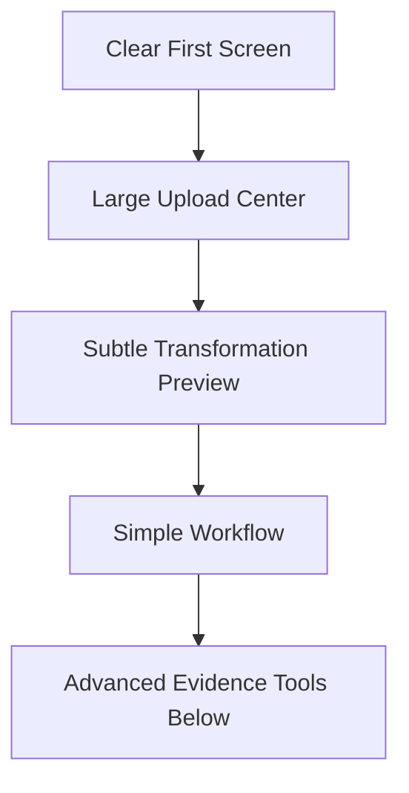

# Step 007.6: Clean UI / Motion Direction

## High-Level Map

## Tech Stack Used

- Next.js and React components.
- Tailwind CSS utility layout.
- CSS keyframe animations with reduced-motion support.
- Existing artifact upload API.

## What Each Part Does

- Hero now keeps one headline and one short supporting sentence.
- Upload is the emotional center with drag-and-drop styling and clear file examples.
- A small animated preview shows messy files becoming a clean case study.
- Workflow is simplified to Upload, Organize, Generate, Publish.
- Evidence coverage, source signals, provenance, and cognition panels remain below the main creation flow.

## How To Reproduce It

1. Run `npm run dev`.
2. Open `http://localhost:3000`.
3. Confirm the first screen is understandable in a few seconds.
4. Confirm upload is the largest action area.
5. Confirm advanced evidence details are below the main upload and workflow sections.

## What Comes Next

After the live production deployment is verified, Step 008 can begin constrained agent reasoning from the confirmed evidence graph.
