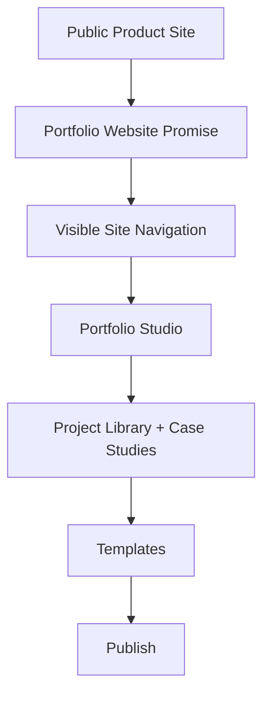

# Step 007.7: Portfolio Website Product Model + HCI UI Review

## High-Level Map

## Tech Stack Used

- Next.js App Router routes for product structure.
- React components for shared navigation, public product site, and skeleton pages.
- Tailwind CSS with reusable token decisions.
- Existing artifact ingestion, parsing, classification, and evidence graph foundation.

## What Each Part Does

- `/` now presents Auto-CaseStudy as a full portfolio website builder.
- `/studio` keeps the authenticated-style creation workspace.
- `/projects`, `/templates`, and `/publish` establish product skeletons for the larger portfolio workflow.
- The homepage preview shows a portfolio website with hero/profile, projects, an expanded case study, resume/skills, and contact.
- Case studies are framed as one output inside a broader portfolio site.

## Design System Foundation

- Colors: dark neutral background, elevated surface/panel layers, muted text, primary lavender, emerald success, amber warning, danger red, paper preview surface.
- Typography: Inter for product UI, Newsreader available for editorial portfolio moments, consistent label/body/heading hierarchy.
- Spacing: 4px/8px-based rhythm, larger section gaps for calm scanning, constrained desktop width.
- Buttons: one primary action per screen, minimum 44px height, visible focus state.
- Cards: 8px radius, line border, subtle hover lift, no nested decorative card stacks above the fold.
- Background: restrained dark studio surface with paper preview contrast for published portfolio output.
- Motion: soft fade-in, gentle card hover, subtle workflow scan, reduced-motion override.

## HCI/UI Review Checklist

- Clarity: first screen states full portfolio website creation.
- Hierarchy: upload and portfolio preview dominate the first screen.
- Navigation: Home, Projects, Portfolio Studio, Templates, Publish are visible.
- Typography: headings are concise, body text is limited and scannable.
- Color consistency: semantic token palette reused across pages.
- Accessibility: semantic nav, focus states, 44px controls, non-color-only labels.
- Contrast: dark UI uses high-contrast ink/muted text; preview uses dark text on paper.
- Mobile responsiveness: grids collapse to single-column content with touch-sized controls.
- User task flow: public site leads to studio upload; studio leads to evidence review and publishing.
- Cognitive load: advanced source signals, provenance, and cognition details stay below the primary product promise.
- Error prevention: placeholder pages state future scope instead of pretending features are complete.
- Affordances: links, buttons, upload card, and cards have visible hover/focus feedback.
- Feedback states: upload state, error alert, deployment docs, and skeleton routes are explicit.
- Empty states: Projects/Templates/Publish provide polished product skeletons.

## How To Reproduce It

1. Run `npm run dev`.
2. Open `/` and confirm the user understands this creates a full portfolio website.
3. Open `/studio` and confirm it remains the creation workspace.
4. Open `/projects`, `/templates`, and `/publish` and confirm each route communicates planned product structure.
5. Check mobile width for clean stacking and readable text.

## What Comes Next

Step 008 remains blocked until this product model correction is verified in production. After that, constrained agent reasoning should generate a portfolio site model, not only one case study.
