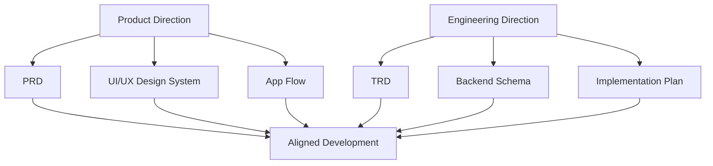

# Step 007.8: Product & Engineering Documentation Foundation

## High-Level Map

## Tech Stack Used

- Markdown documentation in `/docs`.
- Mermaid diagrams for architecture and flow maps.
- Existing codebase and Prisma schema as source references.

## What Each Part Does

- `PRD_PRODUCT_REQUIREMENTS.md`: product vision, users, workflows, requirements, metrics, MVP, roadmap.
- `TRD_TECHNICAL_REQUIREMENTS.md`: architecture, API strategy, infra, auth, security, deployment, observability.
- `UI_UX_DESIGN_SYSTEM.md`: typography, color, spacing, motion, accessibility, component, navigation, and HCI rules.
- `APP_FLOW.md`: navigation map, portfolio creator flow, public viewer flow, admin flow, upload-to-publish flow.
- `BACKEND_SCHEMA.md`: current schema, future entities, permissions, audit logging, and out-of-scope booking/payment notes.
- `IMPLEMENTATION_PLAN.md`: milestones, dependencies, QA, release, rollback, and definitions of done.

## How To Reproduce It

1. Open `/docs`.
2. Read the PRD to understand product direction.
3. Read the TRD to understand architecture.
4. Read the UI/UX system before changing interface patterns.
5. Read the app flow before adding routes or screens.
6. Read backend schema before adding data models.
7. Read implementation plan before starting a new milestone.

## What Comes Next

Step 008 can only begin after these documents are accepted as the baseline. Future development should update the relevant document whenever product, UX, architecture, schema, or release strategy changes.
