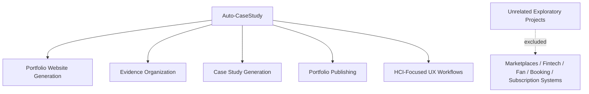

# Step 007.9: Product Scope Isolation

## High-Level Map

## Tech Stack Used

- Markdown documentation updates in `/docs`.
- No application code changes.

## What Each Part Does

- PRD now explicitly excludes marketplace, fan engagement, fintech, booking, payout, subscription, and mobile money systems.
- App flow now uses portfolio owner and public portfolio viewer language.
- Backend schema now excludes unrelated data domains instead of modeling them.
- TRD now uses portfolio owner language for the studio boundary.

## How To Reproduce It

1. Open the PRD, TRD, App Flow, and Backend Schema docs.
2. Confirm the platform scope is limited to Auto-CaseStudy portfolio website generation.
3. Confirm unrelated marketplace, fintech, creator payout, booking, and subscription architecture is excluded.

## What Comes Next

Continue development only around portfolio website generation, case study generation, evidence organization, portfolio publishing, HCI-focused UX workflows, and portfolio studio architecture.
