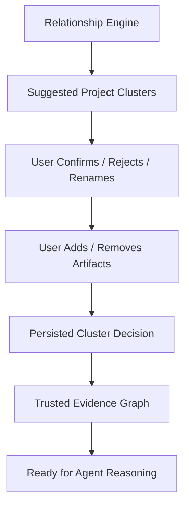

# Step 007: User-Confirmed Evidence Graph

## High-Level Map

## Tech Stack Used

- Next.js API route for evidence-map updates.
- Zustand for optimistic UI updates.
- Prisma `ProjectCluster` model when `DATABASE_URL` is configured.
- Local `.data/evidence-map-decisions.json` fallback for development.
- Tailwind UI controls for accessible cluster editing.

## What Each Part Does

- `src/lib/server/evidence-map-repository.ts` stores user cluster decisions in PostgreSQL or local JSON.
- `src/app/api/evidence-map/route.ts` validates and saves a full project cluster decision.
- `src/app/api/artifacts/route.ts` merges generated relationship clusters with saved user decisions before returning the evidence map.
- `src/store/use-portfolio-store.ts` keeps the reviewed graph in the client state.
- `EvidenceMapPanel` lets the user rename, confirm, reject, mark needs-review, remove artifacts, and manually add artifacts to a cluster.

## How To Reproduce It

1. Run the app locally.
2. Upload or keep multiple parsed/classified artifacts with overlapping project clues.
3. Open the Project Cluster Review panel.
4. Rename a cluster or change its status.
5. Remove one artifact or add a different artifact manually.
6. Refresh the page and confirm the saved cluster decision is still applied.

## What Comes Next

Step 008 should begin safe, constrained agent reasoning only from confirmed or reviewed evidence graph data. The agent should not generate a case study from rejected clusters or unsupported relationships.
