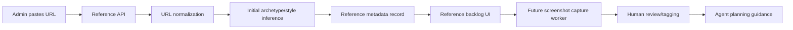

# Step 008 - Portfolio Reference Intelligence System

## Goal

Build an internal system that collects, organizes, and analyzes portfolio references to guide future agent planning, layout generation, storytelling structure, and portfolio strategy.

This is not a visual inspiration gallery. It is a structured portfolio intelligence dataset.

## High-Level Map



## Tech Stack Used

- Frontend: Next.js App Router page at `/references`.
- API: Next.js route at `/api/portfolio-references`.
- Data model: TypeScript reference types.
- Storage: local `.data/portfolio-references.json` foundation.
- Future capture: Playwright or Puppeteer screenshot worker.

## What Each Part Does

- `portfolio-reference-types.ts`: defines archetypes, style labels, screenshot records, metadata, review tags, and capture status.
- `portfolio-reference-intelligence.ts`: normalizes URLs and performs deterministic initial archetype/style inference.
- `portfolio-reference-repository.ts`: stores and lists reference records.
- `/api/portfolio-references`: accepts URL ingestion and returns the reference dataset.
- `/references`: internal UI for adding URLs and reviewing the reference backlog.
- Middleware protects `/references` and `/api/portfolio-references` when studio protection is configured.

## Current Scope

Implemented now:

- URL ingestion.
- Public URL validation.
- Reference metadata schema.
- Archetype/style inference seed.
- Capture status queue.
- Review tags.
- Internal reference backlog page.
- Protected API/page routing.

Not implemented yet:

- Automated website visit.
- Full-page screenshot capture.
- Project-page discovery.
- Visual hierarchy analysis.
- Human tag editing.
- Search/filter UI.
- Agent use of references during portfolio planning.

## How To Reproduce It

```bash
npm install
npm run build
npm run dev
```

Open `http://localhost:3000/references`.

Add a portfolio URL. Confirm it appears in the reference backlog with archetype, style, capture status, and review tags.

## Security / Privacy Notes

- Reference URLs are external public websites only.
- The system stores URLs and metadata, not copied site content.
- Screenshot capture is queued but not active yet.
- References must guide patterns only and must not be copied directly.
- This internal page is protected by the same studio password middleware when configured.

## QA Checklist

- Build passes.
- Empty URL is ignored by the form.
- Invalid URL returns a clear API error.
- Local/private URLs are rejected.
- Duplicate normalized URLs do not create duplicate records.
- Reference backlog loads after refresh.
- `/references` and `/api/portfolio-references` are included in protected route prefixes.

## Feasibility Notes

- Playwright/Puppeteer screenshot capture on Vercel can be heavy and may require a dedicated job runner.
- Screenshot storage should use durable object storage, not local `.data`.
- Public websites may block automation or lazy-load content unpredictably.
- Human review remains required because automated visual analysis can misread portfolio quality.

## What Comes Next

- Add Playwright capture script for homepage screenshots.
- Add project-page discovery and screenshot capture.
- Add admin tag editing and search/filter.
- Move reference records to PostgreSQL.
- Store screenshots in Vercel Blob/S3.
- Feed reviewed reference patterns into portfolio planning agents.
