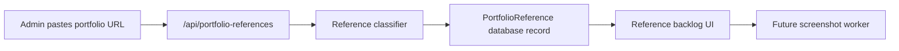

# Step 009: Durable Reference Metadata

## Goal

Move portfolio reference metadata away from JSON-only storage and prepare it for durable production storage.

This is the first durable storage step for the Portfolio Reference Intelligence System. Screenshot files and uploaded artifacts still need durable object storage in a later step.

## High-Level Map

## Tech Stack Used

- Next.js API route for reference ingestion.
- Prisma ORM for database access.
- PostgreSQL via `DATABASE_URL` for durable metadata.
- Local `.data/portfolio-references.json` fallback for development.
- Browser localStorage fallback for hosted demos without durable storage.

## What Each Part Does

- `PortfolioReference` Prisma model stores URLs, archetype labels, capture status, screenshots metadata, review tags, and admin notes.
- `portfolio-reference-repository.ts` uses Postgres when `DATABASE_URL` exists.
- Local JSON remains a dev fallback so the app can run without external services.
- Browser fallback keeps the UI usable while production storage is being configured.

## How To Reproduce

1. Configure a PostgreSQL database and set `DATABASE_URL`.
2. Run `npm run db:generate`.
3. Run `npm run db:push`.
4. Start the app.
5. Open `/references`.
6. Paste a public portfolio URL.
7. Confirm it appears in the reference backlog.

## Security / Privacy Notes

- Reference URLs are intended to be public websites only.
- Private network and localhost URLs are rejected by the URL normalizer.
- This step stores metadata, not screenshots or copied website content.
- Screenshot capture must use durable object storage and should not copy references as templates.
- When studio protection is enabled, `/references` and `/api/portfolio-references` are protected by middleware.

## QA Checklist

- Build passes.
- Prisma Client generates successfully.
- App still works without `DATABASE_URL` using local fallback.
- With `DATABASE_URL`, records are created in the database instead of `.data`.
- Duplicate normalized URLs return the existing reference.
- Hosted UI does not show raw server filesystem paths.

## What Comes Next

Step 010 should add durable object storage for files and screenshots:

- Vercel Blob or S3 bucket setup.
- Private artifact upload strategy.
- Screenshot storage keys.
- Reference screenshot capture worker.
- Storage URL privacy review.
