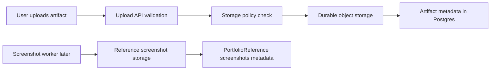

# Step 011: Durable File + Screenshot Storage

## Goal

Add a safe durable storage foundation for uploaded artifacts and future portfolio reference screenshots.

Postgres now stores metadata. This step defines where binary files live and prevents production from silently using `.data`, `/tmp`, or browser storage for files that need to survive deployment.

## High-Level Map

## Tech Stack Used

- Next.js API routes for upload handling.
- Vercel Blob support through `@vercel/blob`.
- Local `.data/uploads` fallback for development only.
- `/tmp/auto-casestudy` only as temporary serverless scratch space.
- Prisma/Postgres for file metadata records.

## What Each Part Does

- `storeArtifactFile`: stores uploaded source artifacts.
- `storeReferenceScreenshot`: stores public portfolio reference screenshots for the future screenshot worker.
- `StorageConfigurationError`: returns safe JSON errors when production storage is not configured.
- `/api/artifacts`: validates file type, file count, file size, stores bytes, parses supported content, and records metadata.

## Security / Privacy Notes

- Uploaded artifacts may contain private school, work, resume, or research data.
- Production must not silently store private artifacts in ephemeral serverless folders.
- Vercel Blob URLs are public in this MVP path, so artifact upload remains fail-closed unless `AUTOCASESTUDY_ALLOW_PUBLIC_ARTIFACT_URLS=true`.
- Reference screenshots are less sensitive because they capture public portfolio websites, but they still must not be copied as templates.
- API responses continue hiding private storage URLs from the client unless the artifact is explicitly marked `public-demo`.
- Unsupported file types are rejected before storage.
- File count, per-file size, and batch size limits remain enforced.

## How To Reproduce

Local development:

1. Leave `BLOB_READ_WRITE_TOKEN` empty.
2. Run the app locally.
3. Upload a supported test file.
4. Confirm the file writes to `.data/uploads`.
5. Confirm metadata appears in the artifact library.

Production demo storage:

1. Add Vercel Blob to the Vercel project.
2. Confirm `BLOB_READ_WRITE_TOKEN` exists in Production and Preview environments.
3. For a demo-only deployment, set `AUTOCASESTUDY_ALLOW_PUBLIC_ARTIFACT_URLS=true`.
4. Redeploy.
5. Upload a non-sensitive test file.
6. Confirm metadata records are created and storage visibility is `public-demo`.

Private production storage:

1. Add a private object storage strategy before real user uploads.
2. Keep `AUTOCASESTUDY_ALLOW_PUBLIC_ARTIFACT_URLS=false`.
3. Generate short-lived signed URLs only for authorized users.

## QA Checklist

- Build passes.
- Local uploads still work without Blob.
- Production without Blob returns a clear JSON storage error.
- Production with Blob but public artifacts disabled returns a clear JSON fail-closed error.
- File URLs are not exposed to the client for private/local artifacts.
- Screenshot storage utility can store PNG bytes locally or in Blob.
- No raw `/var/task` or stack trace errors appear in upload responses.

## What Comes Next

Step 012 should decide the production privacy path:

- Demo path: Vercel Blob with explicitly public demo artifacts.
- Real product path: private S3/R2 storage with signed URLs.
- Then implement the screenshot capture worker using Playwright and `storeReferenceScreenshot`.
