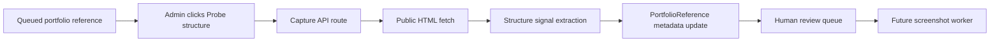

# Step 012: Reference Structure Probe

## Goal

Move portfolio references from a passive URL backlog into an active capture pipeline foundation.

This step does not claim full screenshot intelligence yet. It safely visits a public portfolio URL, extracts basic page structure signals, stores them in the reference metadata record, and keeps screenshot status queued for the browser capture worker.

## High-Level Map

## Tech Stack Used

- Next.js API route: `/api/portfolio-references/[referenceId]/capture`.
- Prisma/Postgres-backed reference repository.
- Server-side `fetch` with timeout for public HTML pages.
- Deterministic structure extraction for headings, nav links, semantic regions, and recruiter signals.
- Existing screenshot metadata model remains queued until Playwright/Puppeteer capture is added.

## What Each Part Does

- `probeReferenceStructure`: visits the reference URL and extracts low-risk structure signals.
- `updatePortfolioReference`: updates database or local fallback records.
- Reference UI: adds a `Probe structure` action to each server-backed reference.
- `captureStatus`: moves from `Queued` to `Needs Review` when the probe succeeds, or `Failed` when the public page cannot be read.

## How To Reproduce

1. Open `/references`.
2. Add a public portfolio URL.
3. Click `Probe structure`.
4. Confirm the status changes to `Needs Review`.
5. Confirm the record still says screenshot capture is pending.
6. Inspect the database record to see updated metadata.

## Security / Privacy Notes

- Only public `http` and `https` portfolio URLs should be ingested.
- Private/local URLs are rejected during reference creation.
- The probe reads HTML structure only; it does not copy content into templates.
- The system records observations for human review, not final agent truth.
- Fetch failures are stored as capture failures without exposing stack traces.
- Screenshot capture remains separate because browser automation has different runtime and abuse risks.

## QA Checklist

- Build passes.
- Probe endpoint returns `404` for missing references.
- Probe succeeds for accessible public HTML pages.
- Probe fails safely for blocked/non-HTML pages.
- Reference UI disables probe for browser-local fallback references.
- Screenshot records remain `Queued` until a real browser screenshot worker stores images.

## What Comes Next

Step 013 should add the actual browser screenshot worker:

- Playwright/Puppeteer runtime decision.
- Full-page homepage screenshot.
- Optional project-page discovery.
- Store screenshot PNGs through `storeReferenceScreenshot`.
- Update screenshot metadata with storage URL, storage key, and capture timestamp.
