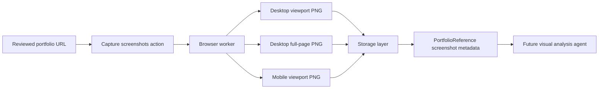
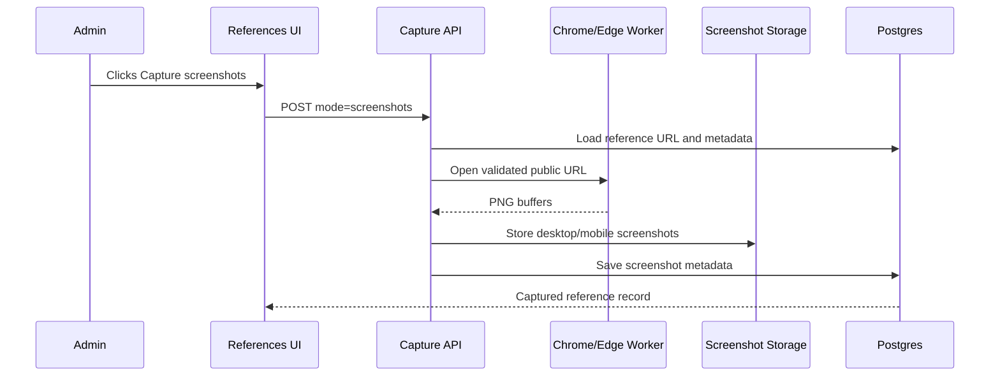

# Step 013: Reference Screenshot Worker

## Goal

Capture real visual evidence from external portfolio references so future visual analysis can understand layout, rhythm, hierarchy, media placement, and responsive behavior.

This step captures screenshots. It does not yet perform multimodal visual analysis.

## High-Level Map

## Data Flow Map

## Tech Stack Used

- `playwright-core` for controlling an installed Chrome/Edge browser.
- Next.js API route: `/api/portfolio-references/[referenceId]/capture`.
- Existing `storeReferenceScreenshot` storage utility.
- Postgres JSON screenshot metadata.
- Local `.data/reference-screenshots` fallback for development.

## Why This Stack Was Chosen

- `playwright-core` gives deterministic browser control without forcing bundled browser downloads into the app package.
- An installed Chrome/Edge executable keeps local capture lightweight and works with a dedicated admin browser window.
- The existing storage abstraction keeps screenshots separate from metadata and prepares for Blob/S3 migration.
- Postgres keeps the captured screenshot records queryable for future visual analysis and human review.

## What Each Part Does

- `reference-screenshot-worker.ts`: launches a browser and captures screenshots.
- `storeReferenceScreenshot`: stores PNG bytes locally or in configured Blob storage.
- `PortfolioReferenceScreenshot`: records viewport, capture kind, dimensions, storage URL, storage key, and timestamp.
- Reference UI: exposes `Capture screenshots` for server-backed references.

## Capture Set

Each reference captures:

- Desktop viewport: what recruiters see first.
- Desktop full page: complete layout rhythm and section sequence.
- Mobile viewport: responsive first impression.

These captures support future analysis of:

- color palette
- contrast
- typography scale
- visual hierarchy
- spacing density
- card/layout systems
- navigation pattern
- project card structure
- media density
- screenshot/text balance
- recruiter scanability

## How To Reproduce

1. Install Chrome or Edge on the worker machine.
2. Optionally set `AUTOCASESTUDY_CHROMIUM_EXECUTABLE_PATH`.
3. Open `/references`.
4. Add or choose a portfolio reference.
5. Click `Capture screenshots`.
6. Confirm the reference status changes to `Captured`.
7. Confirm screenshot links appear in the reference card.

## Security / Privacy Notes

- This worker captures public portfolio references only.
- Captured screenshots are used for internal pattern intelligence, not copying.
- Browser automation has different abuse risk than metadata probing, so the worker must remain admin/internal.
- Production serverless browser support may require a dedicated worker runtime.
- Screenshot files should be treated as reference material, not source templates.
- Browser automation must not be exposed to normal users yet.
- URL validation, private/localhost/IP blocking, timeout limits, clear errors, admin-only access, logging, and later rate limiting are required for browser automation work.

## QA Checklist

- Build passes.
- Missing browser executable returns a clear configuration error.
- Successful capture stores three PNG records.
- Screenshot metadata includes viewport, capture kind, timestamp, and dimensions.
- Local development stores screenshots under `.data/reference-screenshots`.
- Hosted capture requires durable screenshot storage.

## Failure Modes

- Browser executable missing: return a clear configuration error and do not mark screenshots as captured.
- Target site blocks automation: mark capture failed and preserve the reference for human review.
- Screenshot storage unavailable: return a storage configuration error and do not drop metadata silently.
- Navigation timeout: mark capture failed with a concise reason.
- Public URL later becomes unavailable: keep the existing reference record and require re-review.

## What Comes Next

Step 014 should add visual analysis on captured screenshots:

- dominant color palette extraction
- layout archetype labels
- media density estimation
- above-the-fold analysis
- visual hierarchy notes
- recruiter scanability notes
- human review fields for strengths and weaknesses
