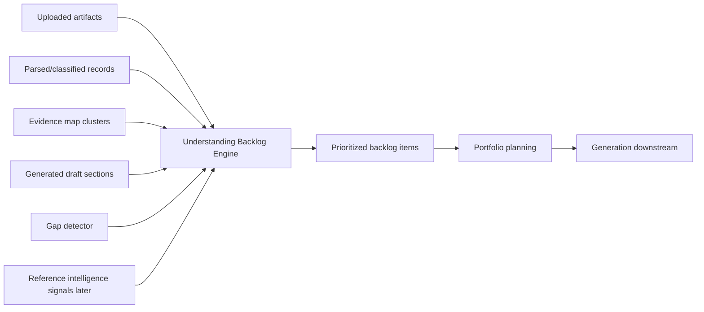
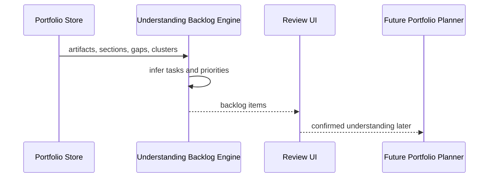

# Step 014: Understanding Backlog Engine

## Goal

Transition Auto-CaseStudy from reference/evidence collection toward structured understanding.

The Understanding Backlog Engine creates prioritized intelligence tasks before generation. It tells the system what needs confirmation, evidence, media, project reconstruction, recruiter clarification, or guardrail review before portfolio pages should be confidently generated.

## High-Level Architecture Diagram



## Data Flow Map



## Tech Stack Used

- TypeScript deterministic engine in `src/lib/understanding-backlog.ts`.
- Existing artifact, gap, section, and cluster types.
- React `useMemo` for client-side derivation.
- Review view panel in `PortfolioStudio`.

## Why This Stack Was Chosen

- Deterministic logic keeps the product honest before LLM reasoning.
- The engine can run locally without cost, latency, or hallucination risk.
- TypeScript types make backlog inputs and outputs explicit.
- The UI makes the agent's uncertainty visible before generation.

## What Each Part Does

- `buildUnderstandingBacklog`: converts evidence state into prioritized tasks.
- `UnderstandingBacklogItem`: describes category, priority, status, rationale, action, sources, clusters, and output target.
- `UnderstandingBacklogPanel`: shows what the agent needs before generation.
- Existing gap detection feeds guardrail and missing-proof backlog items.

## Current Backlog Categories

- Project reconstruction
- Portfolio planning
- Evidence gap
- Media placement
- Recruiter readability
- Guardrail

## How To Reproduce

```bash
npm install
npm run build
npm run dev
```

Open `/studio`, go to `Review`, and inspect `Understanding backlog`.

Upload different artifact types and confirm the backlog changes based on available evidence, visuals, technical files, resume/profile files, gaps, and project clusters.

## Security / Privacy Notes

- The engine uses local metadata and extracted signals already present in app state.
- It does not call external AI services.
- It does not expose private file storage URLs.
- It should mark missing evidence instead of inventing proof.
- Future LLM use must operate on trusted evidence graph inputs and preserve provenance.

## QA Checklist

- Build passes.
- Backlog appears in Review.
- Critical unsupported-claim gaps become guardrail items.
- Visual artifacts create media placement tasks.
- Missing visuals create a media evidence request.
- Technical artifacts create technical credibility tasks.
- Resume/profile artifacts create recruiter alignment tasks.

## Failure Modes

- No artifacts: backlog should ask for evidence rather than generate content.
- Incorrect classification: backlog should request review rather than treat labels as truth.
- No confirmed clusters: backlog should prioritize project boundary confirmation.
- Unsupported sections: backlog should block confident publishing.
- Too many items: UI shows the highest-priority set first.

## What Comes Next

Step 015 should connect the backlog to portfolio planning:

- Convert ready backlog items into a portfolio plan.
- Recommend strongest project order.
- Suggest page-level content slots.
- Suggest case-study structure and media placement.
- Keep unresolved items as generation blockers or follow-up questions.
