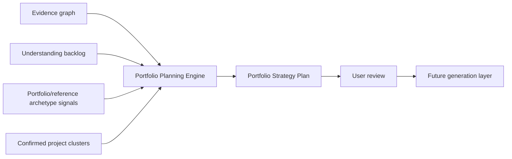
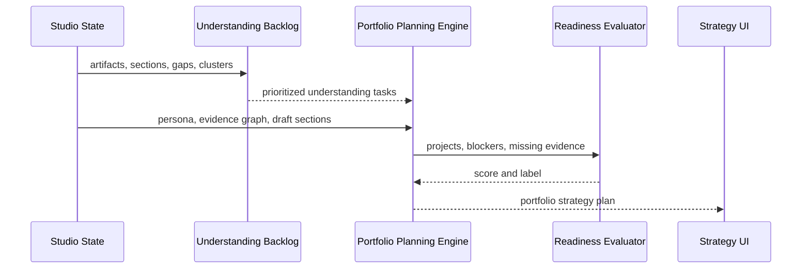

# Step 015: Portfolio Planning Engine

## Goal

Convert trusted evidence, project clusters, reference intelligence foundations, and understanding backlog items into a structured portfolio strategy plan before final generation.

Generation remains downstream of understanding. This step does not generate final publishable pages.

## High-Level Architecture Diagram



## Data Flow Map



## Tech Stack Used

- TypeScript deterministic engine in `portfolio-planning-engine.ts`.
- Typed strategy objects in `portfolio-strategy-types.ts`.
- Readiness scoring in `portfolio-readiness-evaluator.ts`.
- React Strategy panel in `portfolio-studio.tsx`.
- Existing artifacts, clusters, gaps, sections, and backlog items.

## Why This Stack Was Chosen

- Deterministic planning prevents fake AI confidence.
- Explicit types make recommendations inspectable and testable.
- Readiness scoring is separated so blockers and weak evidence can lower confidence consistently.
- The UI surfaces strategy for review before any generation happens.

## Planning Logic

The engine creates:

- homepage strategy
- project ranking
- case-study structures
- media placement suggestions
- missing evidence
- generation blockers
- readiness score
- recruiter-value reasoning
- provenance references

Project ranking considers:

- evidence quality
- visual strength
- research depth
- technical depth
- completeness
- cluster confirmation state

## Evidence Rules

- No fake metrics.
- No unsupported claims.
- Recommendations reference artifacts or clusters when possible.
- Weak evidence lowers readiness.
- Missing evidence becomes follow-up questions or blockers.
- Unsupported sections block confident generation.

## UI Review Layer

The Strategy page now shows:

- readiness state
- homepage positioning
- featured project recommendation
- suggested project order
- generation blockers
- strongest proof references
- media placement suggestions
- missing evidence

This is a planning review surface, not a final generation surface.

## How To Reproduce

```bash
npm install
npm run build
npm run dev
```

Open `/studio`, go to `Strategy`, and inspect the `Portfolio plan` panel.

Change persona, upload artifacts, or confirm clusters. The plan should update from current evidence state.

## Security / Privacy Notes

- The planner consumes existing metadata and extracted signals only.
- No external AI call is made.
- Private storage URLs are not exposed.
- The planner should block weak generation instead of filling gaps with invented claims.
- Future AI generation must consume this plan as constrained input, not as permission to hallucinate.

## QA Checklist

- Build passes.
- Projects rank logically from evidence strength and completeness.
- Weak projects lower readiness.
- Missing evidence creates blockers or warnings.
- Homepage recommendations reference evidence.
- Media placement suggestions appear when visuals exist.
- Unsupported claims are flagged.
- No final publishable pages are generated by this step.

## Failure Modes

- No artifacts: plan is blocked and asks for project evidence.
- No visuals: plan warns that pages may become text-heavy.
- No outcomes: plan blocks or warns on publish readiness.
- No confirmed clusters: plan asks user to review project boundaries.
- Low-confidence evidence: readiness drops and review is required.

## What Comes Next

Step 016 should add user controls for the plan:

- approve project order
- promote/demote projects
- swap homepage strategy
- confirm/remove media placements
- edit inferred case-study structures
- mark blockers resolved or still missing
