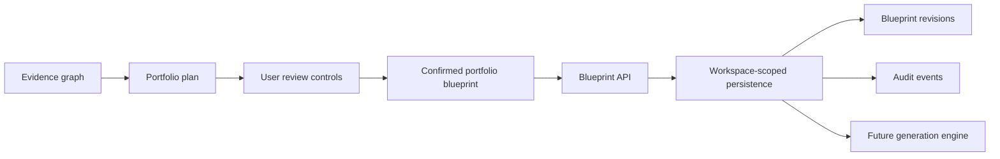
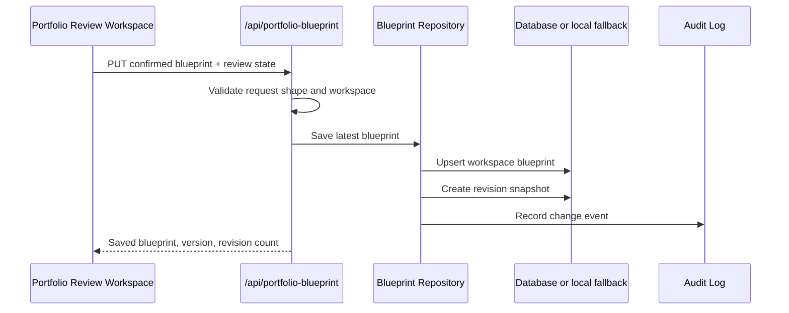
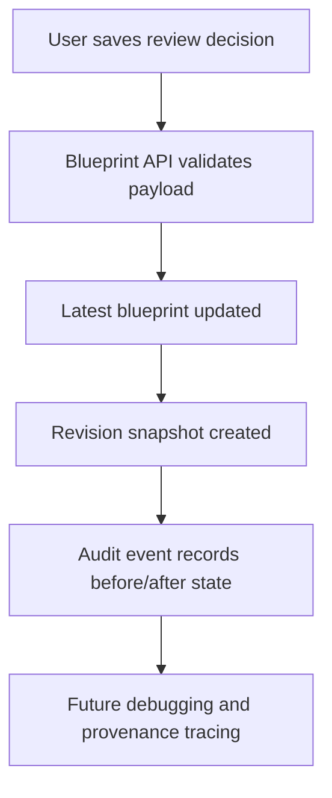

# Step 016.5: Blueprint Persistence & Workspace Integrity

## Goal

Move the Confirmed Portfolio Blueprint from temporary frontend state into durable, trusted, server-backed workspace infrastructure before any generation engine depends on it.

Core principle: the Confirmed Portfolio Blueprint is critical system state. Future generation must read the latest persisted, validated blueprint revision, not transient browser memory.

## High-Level Architecture Diagram

## Persistence Flow

## Tech Stack Used

- Next.js API routes for blueprint persistence endpoints.
- Prisma schema models for production database persistence.
- Local JSON fallback for development without `DATABASE_URL`.
- Zustand remains the local UI review editor, but no longer represents the durable source of truth.
- Workspace cookie scoping follows the existing artifact and evidence-map MVP pattern.

## Why This Stack Was Chosen

- It extends the repository/API pattern already used for artifacts and project clusters.
- It keeps the generation contract typed through `ConfirmedPortfolioBlueprint`.
- It supports Vercel/PostgreSQL when `DATABASE_URL` exists, while keeping local development easy.
- It preserves revisions and audit logs before collaboration and generation make rollback more expensive.

## Workspace Ownership Model

Current MVP:

- Workspace identity comes from `autocasestudy_workspace` cookie or `x-autocasestudy-workspace`.
- Blueprint records are scoped by `workspaceId`.
- API responses only load records for the resolved workspace.

Production requirement before multi-user release:

- Replace cookie-only identity with authenticated user sessions.
- Validate workspace membership and role permissions on every blueprint endpoint.
- Store actor IDs from auth, not workspace ID placeholders.
- Add rate limits and structured authorization failures.

## API Surface

- `GET /api/portfolio-blueprint`
  - Returns latest workspace blueprint, revision count, and audit count.
- `PUT /api/portfolio-blueprint`
  - Validates and persists a confirmed blueprint plus review state.
  - Creates a new revision.
  - Creates an audit event.
- `GET /api/portfolio-blueprint/revisions`
  - Lists recent blueprint revisions for the workspace.
- `POST /api/portfolio-blueprint/revisions`
  - Rolls back to a selected revision by creating a new latest revision from that snapshot.
- `GET /api/portfolio-blueprint/audit-log`
  - Lists blueprint audit events for the workspace.

## Database Models

- `PortfolioBlueprint`
  - Latest workspace blueprint and generation source of truth.
- `PortfolioBlueprintRevision`
  - Immutable-ish snapshots for history, rollback, and future diffing.
- `BlueprintAuditEvent`
  - Change records for saves and rollbacks.

## UI Updates

The Portfolio Review Workspace now shows:

- persistence status
- blueprint version
- revision count
- last saved timestamp
- unsaved changes state
- save blueprint action
- restore previous revision action

## Audit Flow

## Security Notes

- Blueprint payloads are validated at the API boundary before persistence.
- API routes resolve workspace scope server-side.
- No blueprint is exposed publicly.
- Local fallback stores data in `.data` during local development and `/tmp/auto-casestudy` in serverless fallback mode.
- The current workspace cookie is not a substitute for real authentication. Before production user accounts, these endpoints must enforce authenticated workspace membership.
- Blueprint data can include sensitive professional context, so future logs must avoid dumping full private artifacts.

## QA Checklist

- Build passes.
- Blueprint save creates or updates a workspace-scoped latest record.
- Revision count increases after each save.
- Previous revision rollback creates a new latest revision.
- Audit events are recorded for saves and rollbacks.
- UI shows last saved timestamp and unsaved-change state.
- Refresh reloads the latest saved review state into the workspace.
- Rejected projects and visuals remain excluded inside the persisted blueprint.
- Unresolved blockers remain visible and lower readiness.

## Failure Modes

- Database unavailable: API returns an error in production database mode; local dev can use JSON fallback without `DATABASE_URL`.
- Browser storage cleared: latest persisted server blueprint can rehydrate review decisions.
- User rejects every project: blueprint persists as blocked; generation must not proceed.
- Rollback target missing: API returns `404`.
- Workspace identity changes: blueprint from the previous workspace is not loaded.
- Auth not implemented: MVP workspace isolation is weak and must be upgraded before real private users.

## Rollback Strategy

Rollback does not mutate old revision records. It copies the selected revision snapshot into a new latest blueprint revision and records a rollback audit event. This keeps history inspectable.

## What Comes Next

Step 017 should make generation consume only the persisted blueprint:

- add a generation-readiness API
- block generation when no persisted blueprint exists
- block generation when unresolved blockers remain
- generate pages from approved projects, approved visuals, and approved structures only
- keep provenance links attached to generated sections

