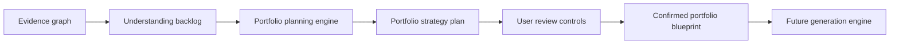
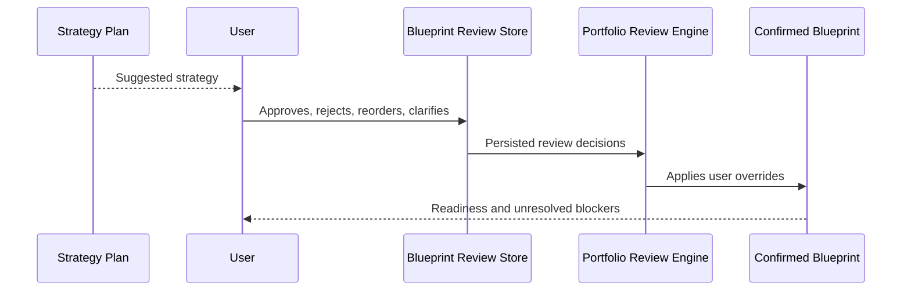

# Step 016: User Review Controls for Portfolio Plan

## Goal

Allow the user to review, approve, modify, and correct the Portfolio Strategy Plan before any generation occurs.

Generation must only use confirmed portfolio planning decisions, not raw inferred assumptions.

## High-Level Architecture Diagram

## Review Workflow

## Tech Stack Used

- `portfolio-blueprint-types.ts` for review and blueprint contracts.
- `portfolio-review-engine.ts` for converting plan + user decisions into a confirmed blueprint.
- `blueprint-review-store.ts` for persisted local user decisions.
- Strategy page review UI in `portfolio-studio.tsx`.
- Zustand persistence for refresh/session durability.

## Why This Stack Was Chosen

- Local persisted state proves the review behavior before adding auth-bound server persistence.
- A separate review engine keeps user decisions above AI assumptions.
- Typed blueprint output creates a future contract for generation.
- The UI makes blockers and overrides visible instead of hiding them.

## User Override Rules

- User decisions override inferred plan recommendations.
- Rejected projects are excluded from the confirmed project order.
- Rejected visuals are excluded from approved visuals.
- Private visuals are tracked separately and must not be published unless explicitly allowed later.
- Unresolved blockers lower readiness.
- Skipped blockers remain explicit user overrides, not silent fixes.

## Provenance Handling

- The blueprint preserves provenance references from the strategy plan.
- Hero proof and visuals are selected from artifact-backed recommendations.
- Future generation must carry these evidence links forward.

## Persistence Flow

Review decisions are stored in browser persistence under `auto-casestudy-blueprint-review`.

This is an MVP foundation. Server-side persistence should be added after auth/workspace ownership is formalized.

## QA Checklist

- Build passes.
- Project order persists across refresh.
- Homepage approval persists.
- Archetype override persists.
- Blocker resolution persists.
- Rejected projects remain excluded.
- Rejected/private visuals remain excluded from approved visuals.
- Unresolved blockers lower readiness.
- Confirmed blueprint summary updates after each review action.

## Failure Modes

- No project evidence: blueprint remains draft/blocking.
- User rejects every project: future generation must stay blocked.
- User skips blockers: blueprint records explicit skip decisions.
- Local storage cleared: plan falls back to inferred strategy and asks for review again.
- Auth/server persistence missing: decisions are local to the current browser only.

## What Comes Next

Step 017 should add server-backed blueprint persistence after authentication/workspace identity is firm:

- `/api/portfolio-blueprint`
- `PortfolioBlueprint` database model
- workspace-scoped blueprint records
- audit log entries for user overrides
- generation engine reads only confirmed blueprint records
