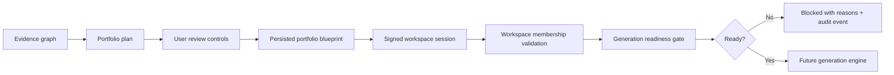
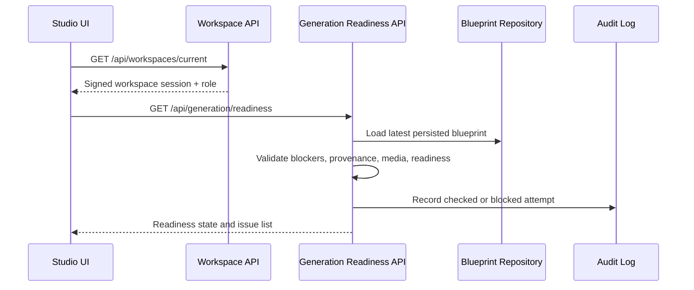

# Step 017: Authenticated Workspace + Generation Readiness Gate

## Goal

Establish trusted workspace infrastructure and enforce strict generation-readiness validation before any generation engine can create portfolio content.

Core principle: generation must only occur from persisted blueprint state, authenticated workspace ownership, and validated evidence-backed readiness.

## Architecture Diagram

## Readiness Flow

## Workspace Ownership Model

Current MVP:

- A server-signed, httpOnly workspace session cookie identifies the workspace and owner role.
- The API still accepts `x-autocasestudy-workspace` only to bootstrap the signed session.
- Blueprint and readiness endpoints resolve workspace identity on the server.
- Database mode upserts `User`, `Workspace`, and `WorkspaceMember` records.

Future production:

- Replace bootstrap workspace identity with real auth.
- Validate authenticated user membership on every protected route.
- Add roles: `owner`, `editor`, `reviewer`, `mentor`, and `recruiter-viewer`.
- Use explicit invite/share records for recruiter and mentor access.

## API Surface

- `GET /api/workspaces`
  - Lists the current accessible workspace for the MVP session.
- `GET /api/workspaces/current`
  - Issues or verifies signed workspace session and returns role.
- `GET /api/generation/readiness`
  - Loads persisted blueprint and returns readiness state.
- `POST /api/generation/validate`
  - Same validation contract, designed as the future pre-generation guard.

## Generation Gate Logic

Generation is blocked when:

- no persisted blueprint exists
- homepage strategy is not approved
- no approved featured project exists
- homepage proof is missing
- no approved project order exists
- unresolved blockers remain
- provenance is missing
- readiness score is below the generation threshold

Warnings are returned when:

- approved visuals are missing
- readiness is acceptable but not clean

## Security Model

- Workspace session cookie is httpOnly, signed, sameSite, and secure in production.
- Production must define `AUTOCASESTUDY_WORKSPACE_SECRET` or `NEXTAUTH_SECRET`; local development uses a non-production fallback only.
- Protected routes resolve workspace server-side.
- Blueprint access is scoped by workspace ID.
- Generation readiness never reads transient Zustand state.
- Readiness checks and blocked attempts are recorded in the blueprint audit log.

Important limitation: this is not yet full user authentication. It is a signed workspace session layer that prepares the system for real auth without pretending the current MVP is complete.

## UI Additions

The studio now shows:

- workspace identity badge
- generation readiness gate
- allowed/not allowed state
- blocker count
- warning count
- persisted blueprint version
- issue explanations
- recheck gate action

## QA Checklist

- Build passes.
- Prisma schema validates.
- Workspace current endpoint returns signed session metadata.
- Persisted blueprint is required for readiness.
- Unresolved blockers prevent generation.
- Missing homepage proof prevents generation.
- Missing provenance prevents generation.
- Rejected visuals remain excluded because readiness reads persisted approved visuals only.
- Readiness checks create audit events.
- UI never treats unsaved Zustand state as generation-ready.

## Failure Modes

- No signed session: API issues a signed workspace session from the bootstrapped workspace ID.
- No persisted blueprint: readiness returns `blocked`.
- Stale browser state: readiness still reads the saved server blueprint.
- Database unavailable: database mode fails; local development can still use JSON fallback.
- User clears cookies: a new workspace session is created, so previous workspace data may not appear unless a real auth layer exists.
- User skips blockers: skipped blockers remain explicit in the blueprint; unresolved blockers still block.

## Next-Step Recommendations

Step 018 should add the first constrained generation engine:

- read only `GET /api/generation/validate` approved state
- refuse generation unless readiness is `ready-for-generation`
- generate a portfolio draft from persisted blueprint sections only
- preserve provenance links on every generated section
- create a generation job record and audit event
