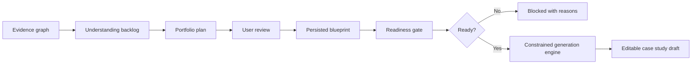
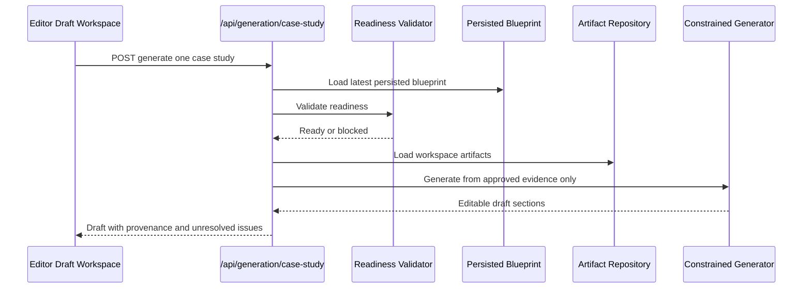
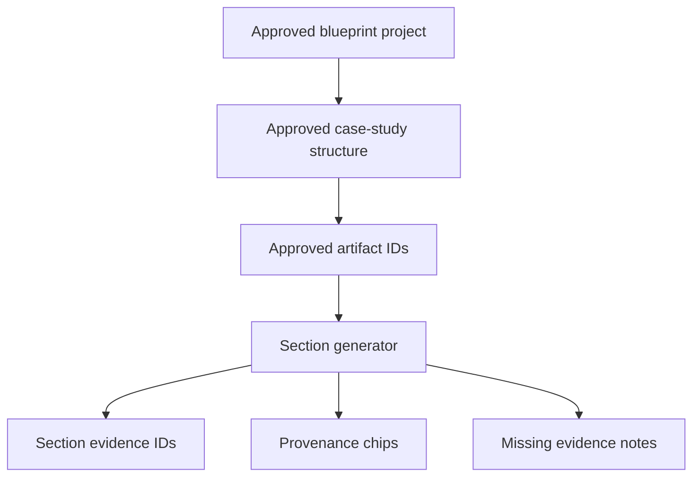

# Step 018: Constrained One-Project Case Study Generation

## Goal

Generate the first evidence-backed portfolio case study using only trusted persisted blueprint data, approved evidence, and validated planning decisions.

This is not full portfolio generation. It is the first product-proof milestone: one editable, provenance-aware project story.

## Architecture Diagram

## Generation Flow

## Tech Stack Used

- Next.js API routes for generation endpoints.
- Deterministic TypeScript generation engine for MVP guardrail proof.
- Prisma `CaseStudyDraft` model for durable generated drafts.
- Local JSON fallback for development without `DATABASE_URL`.
- Existing persisted blueprint, workspace session, artifact repository, and readiness gate.

## Why Deterministic Generation First

The purpose of Step 018 is not creative AI writing yet. The purpose is to prove the system can:

- read persisted blueprint state
- obey approved/rejected decisions
- preserve provenance
- expose missing evidence
- produce editable modular sections

LLM generation can be added later behind the same API after these guardrails are stable.

## Provenance Flow

## Archetype Logic

- `UX Research` and `Academic Research`
  - prioritize research method, insights, findings, and evidence quality.
- `Technical UX Hybrid` and `Cloud/Technical`
  - add a technical credibility section.
  - connect system constraints to product decisions.
- Other archetypes
  - use a general discovery, decisions, solution, outcomes structure.

## Guardrail Logic

Generation is blocked unless:

- a persisted blueprint exists
- readiness gate allows generation
- homepage and featured project are approved
- unresolved blockers are cleared
- provenance exists
- readiness score passes threshold

Generated drafts:

- do not invent metrics
- do not invent dates
- do not invent role ownership
- show missing evidence in section metadata
- keep unsupported claims visible
- use only approved artifact IDs and media IDs

## API Surface

- `POST /api/generation/case-study`
  - Generates one case study from the persisted blueprint.
  - Returns `409` if readiness is blocked.
- `GET /api/generation/case-study`
  - Returns the latest draft for the workspace.
- `GET /api/generation/case-study/[id]`
  - Returns a specific draft by ID.
- `POST /api/generation/validate-section`
  - Validates a generated section's confidence, missing evidence, unsupported claims, and provenance.

## UI

The Editor includes a Case Study Draft Workspace with:

- generate case study action
- editable section text blocks
- confidence labels
- provenance references
- missing evidence warnings
- unsupported claim warnings
- media placement preview
- unresolved issue panel

## QA Checklist

- Build passes.
- Prisma schema validates.
- Generation requires persisted blueprint.
- Readiness gate blocks weak or unresolved blueprints.
- Rejected/private visuals are excluded.
- Generated sections are editable.
- Provenance chips appear per section.
- Missing evidence appears instead of invented claims.
- Technical archetypes include technical credibility section.
- Research archetypes emphasize research evidence.
- Draft is persisted and reloadable.

## Failure Modes

- No blueprint: generation returns blocked.
- Readiness warnings or blockers: generation returns blocked with reasons.
- No approved artifacts: generated draft contains missing evidence sections.
- No final visuals: solution/media sections remain incomplete.
- No outcomes: outcomes section explicitly asks for supported metrics.
- Local fallback on Vercel `/tmp`: usable for runtime proof only; production should use database persistence.

## Hallucination-Prevention Strategy

Step 018 avoids freeform model generation. It builds sections from:

- approved blueprint decisions
- approved artifact IDs
- extracted artifact summaries
- provenance references
- explicit missing evidence notices

Anything unsupported becomes a visible issue, not prose pretending to be true.

## What Comes Next

Step 019 should add an optional LLM rewrite layer behind the same guardrails:

- only rewrite existing generated sections
- keep provenance attached
- require section-level validation after rewrite
- block fabricated metrics, dates, methods, or outcomes
- allow user to accept/reject each rewrite

