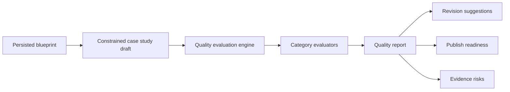
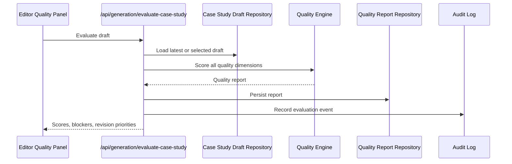

# Step 019: Case Study Quality Evaluation Engine

## Goal

Evaluate generated case studies for professional quality, evidence integrity, recruiter readability, archetype alignment, media quality, writing quality, and portfolio readiness before broader portfolio generation scales.

Core principle: generation success does not equal portfolio quality.

## Architecture Diagram

## Evaluation Flow

## Tech Stack Used

- TypeScript deterministic evaluators for repeatable scoring.
- Next.js API routes for evaluation endpoints.
- Prisma `CaseStudyQualityReport` model for durable report storage.
- Local JSON fallback for development without `DATABASE_URL`.
- Existing audit log infrastructure for evaluation events.

## Scoring Logic

The engine produces six category scores:

- Structural quality
- Evidence integrity
- Recruiter readability
- Archetype alignment
- Writing quality
- Media quality

Overall score uses weighted scoring:

- evidence: 24%
- recruiter readability: 20%
- structure: 16%
- archetype: 16%
- writing: 14%
- media: 10%

Evidence and recruiter readability are weighted highest because the product promise is evidence-backed professional storytelling.

## Archetype Evaluation Rules

UX Research and Academic Research require:

- research method
- insights or findings
- evidence-backed decision rationale

Technical UX Hybrid and Cloud/Technical require:

- technical credibility section
- architecture, implementation, or system reasoning
- connection between technical constraints and product/design decisions

All archetypes require:

- clear decisions
- problem framing
- outcomes or explicit unresolved outcome evidence

## Recruiter Evaluation Logic

The evaluator checks:

- role clarity
- contribution ownership
- outcome visibility
- impact language
- overview length
- first-pass scannability

It flags:

- buried achievements
- missing impact
- unclear role
- overly dense overview

## Evidence Integrity Logic

The evaluator checks:

- section provenance
- section evidence IDs
- missing evidence prompts
- unsupported claims
- top-level provenance

Unsupported claims and missing provenance lower readiness sharply.

## Writing Quality Logic

The evaluator detects:

- thin sections
- overly long sections
- generic placeholder language
- repeated instructional phrases

The current engine is intentionally harsh because Step 018 drafts are deterministic and often need human refinement before publish.

## Media Quality Logic

The evaluator checks:

- media presence
- media provenance
- caption usefulness
- whether captions are still instructional placeholders

No media is a major quality issue for a portfolio case study.

## API Surface

- `POST /api/generation/evaluate-case-study`
  - Evaluates latest or selected case study draft.
  - Persists a `CaseStudyQualityReport`.
- `GET /api/generation/case-study-quality/[id]`
  - Returns a specific quality report.
  - `latest` returns the latest report for the workspace.

## UI

The Editor now includes a Case Study Evaluation Panel with:

- quality scores
- overall readiness
- publish risk
- confidence score
- blocker count
- revision priorities
- unsupported claims
- provenance gaps

## QA Checklist

- Build passes.
- Prisma schema validates.
- Weak drafts receive weak scores.
- Unsupported claims are flagged.
- Missing provenance lowers evidence score.
- Missing outcomes hurt recruiter readiness.
- Technical archetype missing technical section is blocked.
- Research archetype missing research/insights is blocked.
- Missing media lowers media score.
- Quality report persists and reloads.

## Failure Modes

- No draft exists: evaluation API returns `404`.
- Draft has no provenance: evidence score becomes weak.
- Draft is generic but complete: writing score lowers readiness.
- Draft has no media: media score lowers readiness.
- Draft has unsupported metrics: evidence blockers remain visible.
- Database unavailable: local fallback can support development only.

## Next-Step Recommendations

Step 020 should add a constrained revision loop:

- user selects a weak section
- evaluator explains the problem
- system proposes a rewrite using only the same evidence
- user accepts/rejects the rewrite
- section is re-evaluated

This keeps improvement downstream of evaluation and preserves the product doctrine: evidence first, generation second, quality before publishing.

