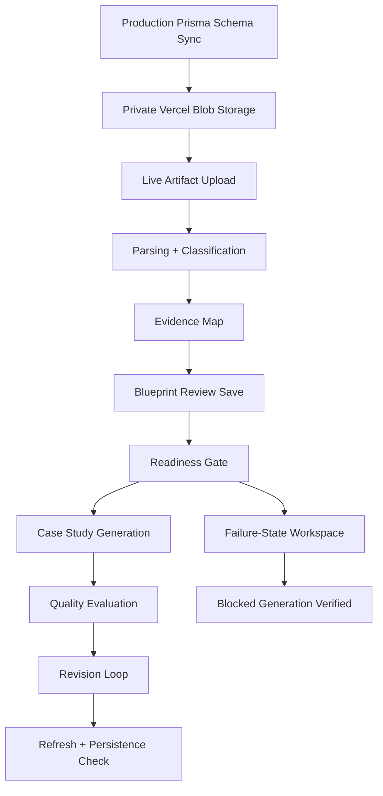

# Step 020.5 — Production QA + Schema Sync

## Purpose

Verify that the Step 018–020 production workflow is durable on Vercel before moving to Step 021. This checkpoint covered database schema sync, durable artifact storage, live upload/parsing/classification, blueprint persistence, readiness validation, case study generation, quality evaluation, revision loop persistence, and failure states.

## High-Level Map



## Production Changes Applied

- Synced production PostgreSQL schema with Prisma using `prisma db push`.
- Added/verified production tables for:
  - `CaseStudyDraft`
  - `CaseStudyQualityReport`
  - `CaseStudyRevision`
  - related blueprint revision and audit infrastructure
- Created and connected private Vercel Blob store:
  - `agentic-portfolio-artifacts`
  - store id: `store_EsZpoZsaz7EBrpyY`
- Changed artifact upload storage to use private Blob access by default.
- Fixed production PDF parsing by importing `pdf-parse/lib/pdf-parse.js` instead of the package debug entry.
- Fixed multi-workspace draft persistence by making generated case study draft ids include the persisted blueprint id.

## Tech Stack Used

- Vercel production deployment
- Neon Postgres through Prisma
- Vercel Blob private storage
- Next.js App Router API routes
- Prisma Client
- `pdf-parse`, `mammoth`, `jszip`
- Headless Chrome via Playwright Core for screenshot capture

## Live QA Target

- URL: `https://i-have-a-project-design-on.vercel.app`
- Final verified commit: `bd8f4a7`
- Happy-path workspace: `qa_step0205_final_1779318337620`
- Failure-state workspace: `qa_step0205_final_1779318337620_weak`
- Screenshot: `.data/qa-screenshots/step0205-final-live-editor.png`

## Results

26 checks passed, 0 failed.

| Check | Result | Notes |
|---|---:|---|
| Live homepage responds | Pass | HTTP 200 |
| Unsupported file rejected | Pass | `.txt` rejected with 415 |
| Oversized file rejected | Pass | oversized PDF rejected with 413 |
| DOCX/PDF/PNG/PPTX upload | Pass | HTTP 200 |
| Artifact records returned | Pass | 4 artifacts |
| Parsing status appears | Pass | DOCX/PDF/PPTX parsed; image visual pending |
| PDF/DOCX/PPTX text extraction | Pass | all text-bearing files parsed |
| Image visual state | Pass | PNG marked `Visual Parsing Pending` |
| Classification appears | Pass | research/design labels returned |
| Evidence map appears | Pass | 4 clusters |
| Blueprint review saves | Pass | HTTP 200 |
| Readiness gate works | Pass | `ready-for-generation` |
| Case study generation works | Pass | 11 sections |
| Quality evaluation works | Pass | overall score 71 |
| Revision proposal works | Pass | latest manual text included |
| Accept revision persists | Pass | accepted and re-evaluated |
| Lock section works | Pass | section becomes non-editable |
| Locked revision attempt blocked | Pass | HTTP 409 |
| Blueprint persists after refresh | Pass | revision count 1 |
| Case study draft persists | Pass | reload by id succeeds |
| Quality report persists | Pass | latest report reloads |
| Revision history persists | Pass | 1 revision |
| Audit logs persist | Pass | 7 events |
| Weak blueprint saves | Pass | separate workspace |
| Weak evidence blocks readiness | Pass | unresolved blocker, missing visual, low score |
| Generation blocked with blocker | Pass | HTTP 409 |

## Bugs Found And Fixed

1. **Production artifact storage missing**
   - Symptom: live upload returned `503 Durable artifact storage is not configured for this deployment`.
   - Fix: created private Vercel Blob store and changed artifact storage to private Blob access by default.

2. **PDF parser failed in production**
   - Symptom: valid Chrome-generated PDF uploaded but returned parser status `Failed`.
   - Cause: ESM import of `pdf-parse` package entry triggered package debug/test behavior.
   - Fix: import `pdf-parse/lib/pdf-parse.js` directly and add a local declaration file.

3. **Case study draft id collision across workspaces**
   - Symptom: generation returned a draft, but later reload/evaluation could not find it in the same workspace.
   - Cause: generated draft ids used only project id and blueprint version, causing collisions across workspaces.
   - Fix: include persisted blueprint id in generated draft id.

## Security And Privacy Notes

- Production uploads now use private Vercel Blob storage by default.
- Public artifact URLs remain opt-in through `AUTOCASESTUDY_ALLOW_PUBLIC_ARTIFACT_URLS=true`.
- API routes continue to sanitize private storage URLs before returning artifacts to the client.
- Revision APIs require workspace sessions and membership checks.
- Locked sections cannot be regenerated or accepted into.
- Weak readiness states block generation instead of silently generating.

## QA Evidence

Final production editor screenshot was captured locally at:

```text
.data/qa-screenshots/step0205-final-live-editor.png
```

Final live QA result JSON was written locally at:

```text
.data/qa-live-results.json
```

These files are intentionally under `.data/` and are not committed because they are operational artifacts.

## Remaining Risks

- The current QA uses scripted API calls plus one browser screenshot, not a full interactive browser test of every button.
- Image understanding is still correctly marked as pending; true visual analysis remains a future AI capability.
- Real user authentication is still future work; the current workspace session is MVP infrastructure.
- Rate limiting is not yet implemented for upload/generation routes.

## Next Step Recommendation

Step 021 can proceed only after keeping these production guarantees intact:

- Generation must use persisted blueprint state.
- Artifact files must remain private by default.
- Revisions must preserve provenance and locking rules.
- Weak evidence must continue blocking generation instead of being hallucinated away.
