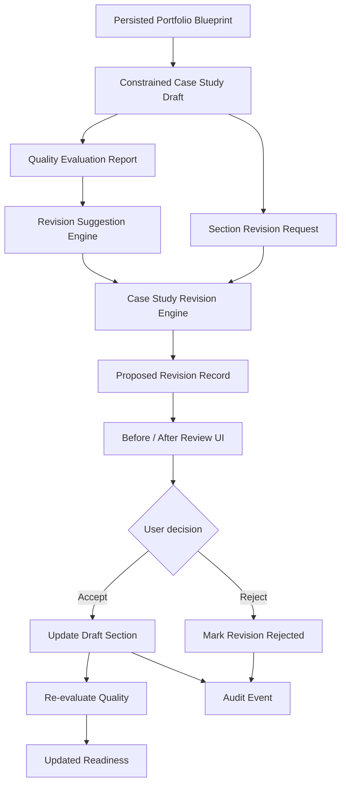

# Step 020 — Case Study Revision Loop

## Purpose

Step 020 turns case study quality evaluation into a controlled revision workflow. The system can now propose section-level improvements, show before/after changes, preserve provenance, let the user accept or reject revisions, and re-score the draft after accepted changes.

Core rule: revision is not uncontrolled regeneration. It is a bounded editorial loop over one section at a time.

## Architecture Diagram

## Data Flow

1. User opens the Case Study Draft Workspace.
2. User chooses a revision goal such as recruiter readability, stronger outcomes, or less AI-sounding language.
3. User clicks **Revise section** on a single editable section.
4. API saves the latest manual section text before proposing a revision.
5. API loads the persisted draft and latest quality report from the workspace.
6. Revision engine proposes a bounded rewrite using only the section content, approved provenance, missing-evidence warnings, and quality issues.
7. UI shows original content, revised content, quality delta, change summary, provenance, and warnings.
8. User accepts or rejects the revision.
9. Accepted revisions update only that section, persist the draft, create an audit event, and re-run quality evaluation.

## Tech Stack Used

- Next.js App Router API routes for revision actions.
- TypeScript domain modules for revision goals, diff summaries, and quality deltas.
- Prisma-backed `CaseStudyRevision` records with local `.data` fallback for development.
- Existing workspace session and membership validation.
- Existing blueprint audit log for traceability.

## Why This Stack

The revision loop sits between generation and publishing, so it must be server-backed and workspace-aware. API routes keep all mutation paths behind ownership checks. Prisma persistence makes revisions durable for production, while local fallback preserves developer velocity.

## Components

- `case-study-revision-engine.ts`: creates evidence-bounded section revisions.
- `revision-suggestion-engine.ts`: selects a default goal from quality report issues.
- `section-diff-engine.ts`: summarizes what changed.
- `revision-quality-delta.ts`: estimates before/after section improvement.
- `revision-audit-repository.ts`: persists revision records.
- `/api/generation/revise-section`: proposes a revision.
- `/api/generation/accept-revision`: applies a proposed revision and re-evaluates quality.
- `/api/generation/reject-revision`: rejects a proposed revision.
- `/api/generation/revision-history/[id]`: loads revision history for a draft.
- `/api/generation/lock-section`: locks or unlocks section editing.

## Provenance Preservation

Every proposed revision carries forward the original section provenance references. Missing evidence and unsupported claim warnings are not removed by revision. If a section lacks the proof required for a stronger outcome, the revision keeps that warning visible instead of inventing metrics.

## Stale Content Protection

The revision API receives the latest visible section text and persists it before creating a proposal. Accepting a revision is blocked if the section changed after the proposal was created. This prevents old revisions from overwriting newer user edits.

## Section Locking Logic

Locked sections cannot be revised or accepted into. This protects user-approved text from accidental AI overwrites. Unlocking is an explicit user action and creates an audit event.

## Security and Privacy Notes

- All revision APIs require a workspace session.
- Workspace membership is checked before access.
- Revisions are scoped by `workspaceId`.
- The browser never decides ownership or final persistence.
- Audit events record revision proposals, accepts, rejects, and section locks.
- Private artifact content is not exposed through public routes.

## QA Checklist

- Build passes.
- A section revision can be proposed.
- Before/after comparison appears in the editor.
- Accepted revision updates only the targeted section.
- Rejected revision does not alter draft content.
- Locked sections cannot be revised.
- A stale revision cannot overwrite newer section text.
- Accepted revisions trigger quality re-evaluation.
- Revision history reloads after refresh.
- Provenance chips remain attached to revised sections.
- Missing evidence warnings remain visible.

## Failure Modes

- Missing draft: return `DRAFT_NOT_FOUND`.
- Missing section: return `SECTION_NOT_FOUND`.
- Locked section: return `SECTION_LOCKED`.
- Changed section after proposal: return `SECTION_CHANGED`.
- Already decided revision: return `REVISION_ALREADY_DECIDED`.
- Draft update failure: return `DRAFT_UPDATE_FAILED`.
- Weak evidence: preserve warning and avoid stronger unsupported claims.

## What Comes Next

Step 021 should improve case study revision depth by adding user-provided clarifications, manual evidence attachment, and targeted section validation before broader portfolio-page generation begins.
