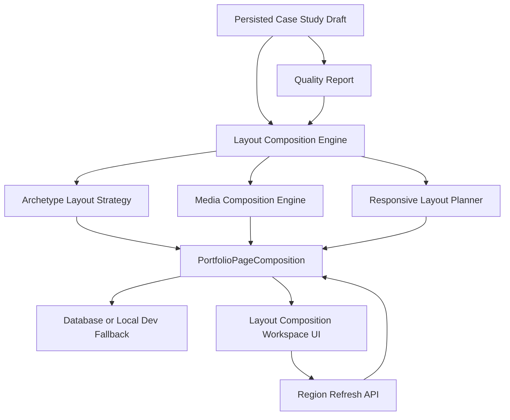
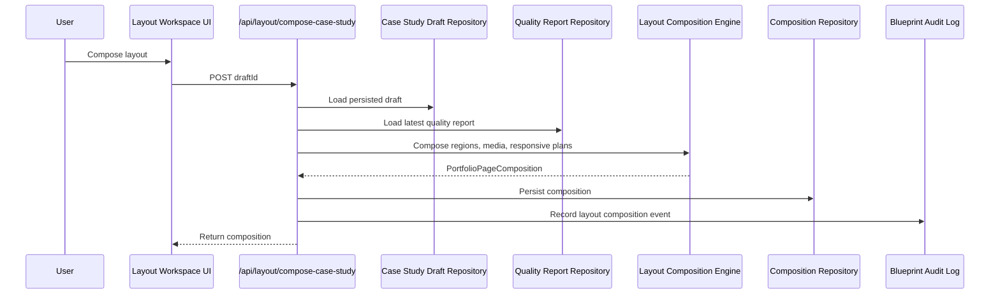

# Step 021 - Layout Composition Engine

## Goal

Transform an approved, evidence-backed case study draft into a structured responsive portfolio page composition.

This step composes layout regions. It does not publish the full portfolio site.

## Architecture Diagram

## Data Flow

## Tech Stack

- Next.js API routes for workspace-protected composition endpoints.
- TypeScript deterministic engines for layout strategy, media placement, and responsive planning.
- Prisma model `PortfolioPageComposition` for durable production persistence.
- Local `.data/layout-compositions.json` fallback for development without database access.
- Existing workspace session and blueprint audit infrastructure for ownership and traceability.

## Why This Stack

- Keeps generation downstream of persisted evidence and approved drafts.
- Avoids visual randomness by making layout composition deterministic and inspectable.
- Preserves production scalability by storing composition as a first-class database object.
- Keeps the MVP fast while preparing for future AI-assisted visual layout generation.

## Components

- `layout-composition-types.ts`: shared composition contracts.
- `archetype-layout-strategies.ts`: archetype-specific section ordering and layout emphasis.
- `responsive-layout-planner.ts`: desktop, tablet, and mobile region plans.
- `media-composition-engine.ts`: approved media to page-region placement.
- `layout-composition-engine.ts`: creates and refreshes `PortfolioPageComposition`.
- `portfolio-page-composer.ts`: page-composer facade for future portfolio-level composition.
- `layout-composition-repository.ts`: database/local persistence.
- `/api/layout/compose-case-study`: creates a composition from a persisted draft.
- `/api/layout/composition/[id]`: loads a saved composition or latest composition.
- `/api/layout/regenerate-region`: refreshes one region without changing approved content.

## Evidence Rules

- Composition uses persisted case study drafts only.
- It does not invent new claims, sections, metrics, or visuals.
- Missing evidence and unsupported claims remain visible as guardrail regions.
- Media placement uses approved case study media only.
- Region refresh changes layout metadata only, not source content or provenance.

## UI Behavior

The editor now includes a Layout Composition Workspace with:

- composed page preview
- responsive desktop/tablet/mobile plan
- media placement map
- archetype strategy notes
- visual rhythm score
- visible guardrails for unresolved evidence gaps
- per-region refresh controls

## Security and Privacy Notes

- API routes require workspace session validation.
- Compositions are workspace-scoped.
- Production storage uses database persistence when `DATABASE_URL` is present.
- Composition records may reference sensitive career evidence, so they must remain private until publish/export is explicitly built.
- Region regeneration does not browse the web, call external services, or expose private artifacts.

## QA Checklist

- [x] Prisma schema validates.
- [x] TypeScript compile passes.
- [x] Next production build passes.
- [x] Security audit reports no high vulnerabilities.
- [ ] Compose layout from an existing persisted draft.
- [ ] Refresh and reload latest composition.
- [ ] Confirm unresolved evidence remains visible.
- [ ] Confirm approved media is the only media placed.
- [ ] Confirm desktop/tablet/mobile plans render without overlap.
- [ ] Confirm region refresh preserves section content and provenance.

## Failure Modes

- No draft exists: API returns `DRAFT_NOT_FOUND`.
- No quality report exists: composition still works but readiness is `not evaluated`.
- No approved media exists: composed page remains text-led and shows a media-empty state.
- Weak evidence exists: composition status becomes `Needs Evidence`.
- Database unavailable locally: repository falls back to `.data/layout-compositions.json`.

## What Comes Next

1. Sync the production database schema for `PortfolioPageComposition`.
2. Run live Vercel QA for layout composition persistence.
3. Add richer visual previews using real uploaded media thumbnails.
4. Add editable region ordering and media swapping.
5. Later, allow the future generation engine to consume only persisted compositions for publishable pages.
