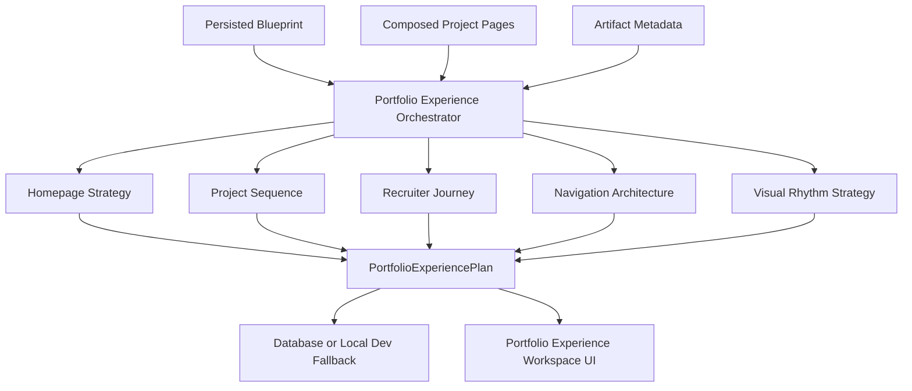
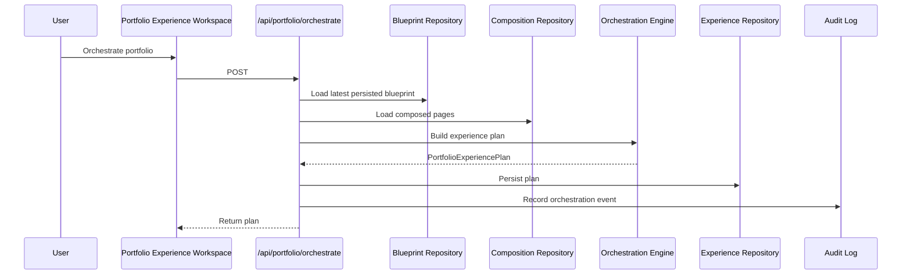

# Step 022 - Portfolio Experience Orchestration Engine

## Goal

Coordinate composed project pages into a cohesive, recruiter-oriented, archetype-aware portfolio experience.

This step does not publish the portfolio. It creates a portfolio-level experience plan that future publishing can consume.

## Architecture Diagram

## Orchestration Flow

## Tech Stack

- Next.js API routes for workspace-protected orchestration actions.
- TypeScript deterministic engines for recruiter journey, rhythm, navigation, and archetype strategy.
- Prisma model `PortfolioExperiencePlan` for durable production persistence.
- Local `.data/portfolio-experience-plans.json` fallback for development.
- Existing workspace session, membership, and blueprint audit infrastructure.

## Engine Modules

- `portfolio-experience-types.ts`: portfolio-level plan contracts.
- `archetype-experience-strategy.ts`: archetype cohesion rules.
- `recruiter-journey-engine.ts`: recruiter scan path and proof sequence.
- `portfolio-rhythm-engine.ts`: media density, repetition risk, and pacing.
- `navigation-architecture-engine.ts`: portfolio navigation hierarchy.
- `portfolio-experience-orchestrator.ts`: combines blueprint, compositions, and artifact metadata.
- `portfolio-experience-repository.ts`: database/local persistence.

## API Surface

- `POST /api/portfolio/orchestrate`: creates a persisted portfolio experience plan.
- `GET /api/portfolio/experience/[id]`: loads a plan or `latest`.
- `POST /api/portfolio/resequence-projects`: updates project ordering without changing evidence or claims.

## Recruiter Journey Strategy

The engine models five recruiter questions:

1. Who is this person professionally?
2. What is the strongest proof of ability?
3. Can I trust the claims?
4. Does this person fit the role?
5. How do I contact or save this candidate?

The plan maps those questions to Home, Projects, Case Study, Skills, and Contact paths.

## Visual Rhythm Strategy

The rhythm engine evaluates:

- approved media density
- unresolved warning load
- average composed-page rhythm score
- repetition risks
- layout variation guidance

It does not create decorative layouts. It produces orchestration metadata for future page assembly.

## Navigation Planning Logic

The default navigation keeps:

- Home and Projects as primary recruiter paths
- About and Resume as secondary context
- Contact as a persistent utility action

Mobile behavior prioritizes Home, Projects, and Contact.

## Archetype Logic

The orchestration adapts tone and emphasis:

- UX Research: evidence, methods, limitations, and findings.
- Product Design: visual decision-making and project rhythm.
- Technical UX Hybrid: systems framing and product credibility.
- Cloud/Technical: implementation proof and operational clarity.
- Recruiter-Optimized: fast proof exposure and shallow navigation.

## Guardrails

- No random project ordering.
- Project order starts from the persisted blueprint.
- Homepage claims come from blueprint positioning and provenance.
- Unresolved blockers remain visible.
- Resequencing does not alter evidence, claims, or composition content.
- Plans are workspace-scoped and private until publishing exists.

## QA Checklist

- [x] Prisma schema validates.
- [x] TypeScript compile passes.
- [x] Next production build passes.
- [x] Security audit reports no high vulnerabilities.
- [ ] Orchestration creates a persisted plan.
- [ ] Latest plan reloads after refresh.
- [ ] Resequencing persists project order.
- [ ] Missing blueprint or composed pages produce warnings, not fake readiness.
- [ ] Navigation hierarchy remains recruiter-friendly.
- [ ] Mobile strategy keeps Home, Projects, and Contact visible.

## Failure Modes

- No blueprint exists: the plan is created as `Needs Evidence` with a missing-blueprint warning.
- No composed pages exist: project sequence remains empty and the UI asks for composed case study pages.
- No approved hero visual exists: homepage strategy keeps the warning visible.
- Weak projects exist: they are marked lower value or held until evidence improves.
- Database unavailable locally: repository falls back to `.data`.

## What Comes Next

1. Sync the production schema for `PortfolioExperiencePlan`.
2. Run live Vercel QA for orchestration persistence.
3. Connect the Preview screen to the persisted experience plan.
4. Add richer editable homepage and navigation controls.
5. Build a publish assembly layer that consumes only persisted experience plans and compositions.
