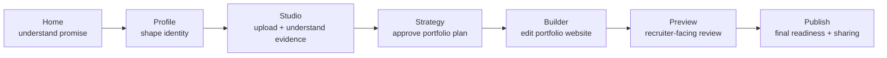

# Step 023.10 - Live UX Regression Audit

## Status
Implemented with targeted fixes.

## Goal
Validate the deployed product from the perspective of a first-time portfolio user before adding deeper rendering or publishing capabilities.

The product should feel like:

> A polished AI-assisted portfolio platform helping professionals shape their career story.

Not:

> An exposed internal AI workflow tool.

## Live Audit Context

- Live URL audited before fixes: `https://i-have-a-project-design-on.vercel.app/?verify=5a02344`
- Live URL verified after fixes: `https://i-have-a-project-design-on.vercel.app/?verify=95fc72a`
- Audit method: in-app browser route inspection, DOM/action checks, console checks, viewport screenshots, and targeted click testing.
- Viewport observed: approximately `949 x 800`, matching the user's right-panel browser context.
- Routes audited: `/`, `/profile`, `/projects`, `/studio`, `/builder`, `/preview`, `/templates`, `/publish`.

## High-Level UX Map

## First-Time User Observations

### Passed
- Home communicates the core promise quickly: build a full portfolio website from messy career evidence.
- Upload remains the primary action.
- The portfolio preview on Home makes the output concrete: home, about, projects, expanded case study, resume, and contact.
- The product language is clearer after Step 023.9; no visible `PortfolioSiteDraft`, `persisted blueprint`, or `readiness gate` copy appeared in audited routes.

### Issue Found
- The secondary Home CTA previously said "View portfolio structure" but routed to `/projects`, where a first-time user may immediately hit an empty-state message. That felt like a mismatch between promise and destination.

### Fix Applied
- Changed the secondary Home CTA to "Explore portfolio systems" and routed it to `/templates`, which is more useful before a user has a saved project library.

## Navigation Observations

### Passed
- Primary routes are available from every audited page:
  - Home
  - Profile
  - Projects
  - Studio
  - Builder
  - Preview
  - Templates
  - Publish
- Active route state works on each primary route.
- `Reference Lab` is not visible in primary navigation.
- No trapped routes were observed.
- Route smoke found no horizontal page overflow at the audited viewport.

### Issue Found
- At the right-panel browser width, the top navigation wrapped awkwardly and pushed `Publish` onto a second line. This made the product feel less premium and less intentional.

### Fix Applied
- Reworked primary navigation into a stable top brand/action row plus a single-line horizontally scrollable nav row. This keeps navigation usable at medium and small widths without awkward wrapping.

## Product Flow Observations

### Passed
- Home -> Studio Upload works.
- Home -> Templates now provides a meaningful first-time exploration path.
- Templates -> Strategy works through "Shape my portfolio."
- Builder -> Studio editor link exists for upstream work.
- Preview -> Builder empty-state action exists after loading.
- Publish remains intentionally blocked until a draft and portfolio checks are ready.

### Remaining Concern
- Studio still contains many expert-level controls in one area. This is acceptable for the current build stage, but future UX passes should add stronger progressive disclosure.

## Builder Observations

### Passed
- Builder feels more like an editing surface after Step 023.9.
- Tabs are understandable:
  - Pages
  - Content
  - Evidence
  - Quality
  - Theme
- Tab selection state works.
- Save Draft is disabled when no draft exists.
- "Create from plan" is visible as the correct next action.
- Empty state explains that Strategy should be finished before creating a draft.

### Remaining Concern
- Builder is still more structural than visual because real canvas rendering is not yet implemented. It is coherent, but it does not yet feel Framer/Wix-like.

## Templates Observations

### Passed
- Templates now has a clear identity as portfolio archetype systems, not generic themes.
- Template options explain different storytelling structures:
  - UX Research
  - Product Design
  - Technical UX Hybrid
  - Recruiter Clean
- Template cards include story rhythm, audience fit, and an action into Strategy.

### Remaining Concern
- Template selection does not yet persist as a first-class portfolio decision. Future work should store selected template/archetype and feed it into Strategy and Builder.

## Preview Observations

### Passed
- Preview page language is recruiter-facing.
- Editor controls do not leak into Preview.
- Empty state says "Create your portfolio draft first" and points to Builder.
- Preview no longer presents itself as an internal diagnostics page.

### Remaining Concern
- Preview still shows a loading skeleton briefly before the empty state. That is acceptable, but the future portfolio preview should feel more visual and realistic once saved drafts contain richer page data.

## Publish Observations

### Passed
- Publish page communicates a clear checklist.
- Publish is blocked with product language, not system language.
- Disabled publish control is intentional and readable.
- The page explains what is missing:
  - portfolio draft
  - issue status
  - evidence coverage
  - open issues

### Remaining Concern
- Publish output cards are still placeholders. That is acceptable because hosted publishing is not implemented yet, but each card should remain disabled or clearly staged until functional.

## Button and Action Matrix

| Page | Action | Result |
| --- | --- | --- |
| Home | Upload evidence | Works; routes to `/studio#ingest`. |
| Home | Explore portfolio systems | Fixed; routes to `/templates`. |
| Templates | Shape my portfolio | Works; routes to `/studio#strategy`. |
| Builder | Pages tab | Works; selected state updates. |
| Builder | Content tab | Works; selected state updates. |
| Builder | Evidence tab | Works; selected state updates. |
| Builder | Quality tab | Works; selected state updates. |
| Builder | Theme tab | Works; selected state updates. |
| Profile | Save profile context | Works in normal browser storage; added user-readable error fallback if storage fails. |
| Publish | Resolve blockers first | Correctly disabled until publishing conditions are met. |

## Product Tone Audit

### Improved
- Tone is calmer and more career-oriented.
- Main pages now talk about portfolio plan, portfolio draft, source links, and portfolio issues.
- The product feels closer to a creation studio than an AI systems dashboard.

### Still Needs Work
- Studio remains dense because it contains evidence review, strategy, generation, evaluation, revisions, layout, and portfolio flow. This should be gradually split or collapsed as the product matures.
- The global progress strip is useful but visually utilitarian; later it should become more elegant and state-aware.

## Regression Checks

| Check | Result |
| --- | --- |
| No trapped routes | Passed |
| Primary nav everywhere | Passed |
| Active nav states | Passed |
| Reference Lab hidden from primary nav | Passed |
| Product language simplified | Passed |
| Builder tabs working | Passed |
| Templates identity clear | Passed |
| Preview editor controls hidden | Passed |
| Publish blocked state readable | Passed |
| Console errors on audited routes | None observed |
| Horizontal overflow at observed viewport | None observed |

## Fixes Applied

1. Stabilized global navigation so it no longer wraps awkwardly at the right-panel browser width.
2. Changed Home secondary CTA from a project-library path to a template/archetype path.
3. Added a user-readable Profile save fallback if local browser storage fails.

## UX Debt Log

- Studio needs progressive disclosure to hide advanced tools until they are relevant.
- Builder needs a richer visual canvas before it can truly feel Framer/Wix-like.
- Preview needs full portfolio rendering from saved site drafts.
- Template selection needs persistence and downstream influence.
- Mobile-specific QA still needs a browser viewport/emulation pass beyond the current right-panel viewport.
- Publishing cards should become clearly actionable only when their workflows exist.

## QA Checklist

- [x] Live Home route audited.
- [x] Live Profile route audited.
- [x] Live Projects route audited.
- [x] Live Studio route audited.
- [x] Live Builder route audited.
- [x] Live Preview route audited.
- [x] Live Templates route audited.
- [x] Live Publish route audited.
- [x] Navigation routes checked.
- [x] Key CTAs checked.
- [x] Builder tabs checked.
- [x] Console errors checked.
- [x] Product-language regression checked.
- [x] Targeted UX fixes applied.
- [x] Post-deploy live verification for this patch.

## Next-Step Recommendations

Before Step 024, verify this patch in production.

Then the next product-facing step should be one of:

1. Preview rendering fidelity from saved portfolio drafts.
2. Template selection persistence.
3. Studio progressive disclosure.
4. Builder visual canvas improvements.

The strongest next move is Preview rendering fidelity, because users need to see a believable portfolio website before publishing can feel real.
