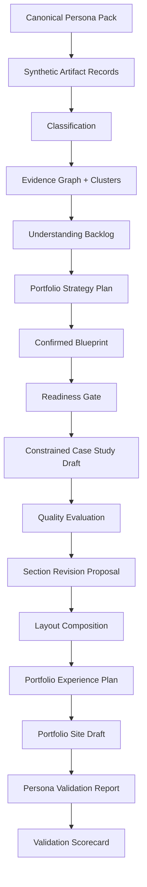
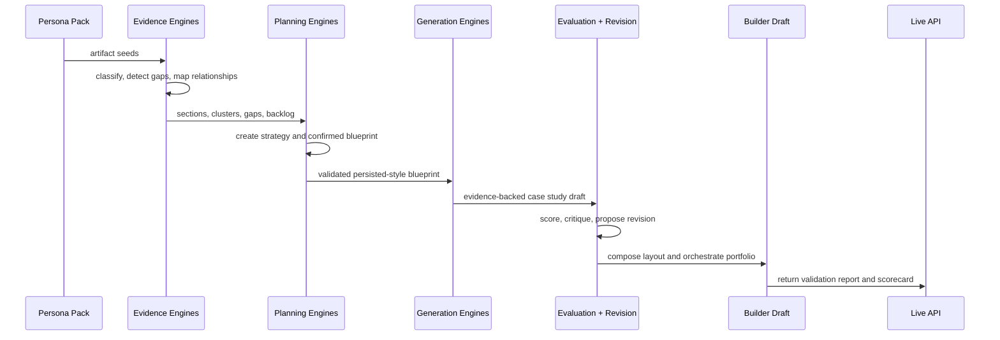

# Step 023.11 — Canonical Persona Pack + End-to-End Product Validation System

## Status
Implemented and locally verified on May 21, 2026.

## Goal
Create realistic canonical persona packs and run the complete Auto-CaseStudy reconstruction pipeline before expanding visual rendering and publishing.

The purpose is truth. These packs intentionally include weak evidence, missing metrics, ambiguous project names, conflicting resume claims, and thin documentation so the product can show where it succeeds and where it still needs help.

## Architecture Diagram



## Data Flow Map



## Tech Stack Used

- Next.js API route for live validation access.
- TypeScript for typed persona fixtures, report contracts, and scorecards.
- Existing deterministic engines for classification, relationship mapping, planning, generation, evaluation, revision, layout, orchestration, and builder draft assembly.
- Mermaid documentation for repeatable architecture teaching.

## Why This Stack

The validation system must use the same product engines as the app. A separate script would be easier, but it could drift from production behavior. The API route proves that the production bundle can run the full chain.

The persona packs are synthetic and repository-versioned so the team can reproduce regressions without relying on private user files.

## Canonical Persona Packs

| Persona | Purpose | Expected Stress |
| --- | --- | --- |
| UX Research Student | Academic-to-professional research storytelling | weak business metrics, reflective outcomes |
| Technical UX Hybrid | Highest-priority wedge and hybrid credibility | UX + cloud evidence tension, role inconsistency |
| Cloud Engineer | Infrastructure evidence into recruiter-readable proof | low visual storytelling, technical density |
| Junior Product Designer | Visual-heavy work with thin process notes | weak research, vague outcomes |
| Messy Real User | Realistic chaos and resilience test | duplicates, conflicts, weak visuals, mixed projects |

Persona fixture notes live in `/persona-packs`.

## Validation Flow

Each pack is run through:

1. Profile context
2. Evidence upload simulation
3. Parsing-ready extracted text
4. Classification
5. Evidence graph
6. Understanding backlog
7. Portfolio strategy
8. Blueprint review
9. Generation readiness gate
10. Constrained case study generation
11. Quality evaluation
12. Section-level revision proposal
13. Layout composition
14. Portfolio orchestration
15. Builder draft assembly
16. Preview preparation check

## Success Criteria

- All personas complete the full pipeline without crashing.
- Weak evidence remains visible.
- Unsupported claims stay flagged.
- Technical and UX artifacts are not flattened into generic writing.
- The strongest project is prioritized logically.
- Builder draft output contains project-page structure.
- The validation system can say “needs attention” instead of forcing a positive demo score.

## Failure Categories

- Parsing or classification confusion.
- Weak project grouping.
- Poor project prioritization.
- Readiness blockers hidden or ignored.
- Unsupported claims polished into fake impact.
- Recruiter readability too low.
- Archetype mismatch.
- Builder draft missing project-page structure.
- Preview preparation blocked by missing state.

## Recruiter Validation Logic

The recruiter checklist looks for:

- strongest project first
- readable project positioning
- visible impact or honest missing-impact note
- source-backed claims
- clear role ownership
- quality report readiness

## UX Validation Logic

The UX checklist looks for:

- blocker honesty
- builder guardrails
- preview preparation coherence
- no invisible magic
- weak evidence surfaced as next action

## Evidence Realism Strategy

The packs deliberately include:

- real-looking filenames
- mixed file types
- incomplete outcomes
- ambiguous role claims
- duplicate notes
- weak screenshots
- separate projects in one evidence pile
- technical artifacts that may overpower the portfolio narrative

This protects the product from only working in ideal demo conditions.

## API

Run all packs:

```text
GET /api/persona-validation
```

Run one pack:

```text
GET /api/persona-validation?persona=technical-ux-hybrid
```

The route returns synthetic validation data only. It does not expose user workspaces or private artifacts.

## Local Verification Results

Local production build route smoke:

| Check | Result |
| --- | --- |
| Persona packs | 5 |
| Average overall score | 70 |
| Validated | 0 |
| Needs attention | 5 |
| Failed | 0 |
| Technical UX Hybrid score | 79 |
| Technical UX Hybrid status | needs attention |
| Technical UX Hybrid readiness | blocked |

Persona-level local results:

| Persona | Overall | Status | Readiness | Warnings | Fails |
| --- | ---: | --- | --- | ---: | ---: |
| UX Research Student | 70 | needs attention | blocked | 5 | 0 |
| Technical UX Hybrid | 79 | needs attention | blocked | 3 | 0 |
| Cloud Engineer | 67 | needs attention | blocked | 4 | 0 |
| Junior Product Designer | 61 | needs attention | blocked | 6 | 0 |
| Messy Real User | 72 | needs attention | blocked | 3 | 0 |

Interpretation: the pipeline completes, but the validation system correctly refuses to pretend the outputs are publish-ready. This is the right behavior before Step 024.

## QA Checklist

- [x] TypeScript compile passes.
- [x] Next production build passes.
- [x] Persona API appears in the production route manifest.
- [x] Local production server can run all persona packs.
- [x] Single-persona route works for Technical UX Hybrid.
- [x] No critical crashes across five persona packs.
- [x] Weak evidence remains represented as warnings or blockers.
- [x] The scorecard can produce “needs attention.”
- [x] Synthetic route avoids private workspace data.
- [ ] Live Vercel endpoint verified after push.

## Failure Modes

- If a core engine type changes, persona validation should fail at compile time.
- If a product engine silently drops provenance, the believability checklist should lower the score.
- If readiness becomes too permissive, blocked messy personas may incorrectly pass.
- If builder draft assembly changes, the builder coherence score may drop.

## Security and Privacy Notes

- Persona packs are synthetic and contain no private user data.
- The live route returns validation fixtures only.
- The route must not query user workspaces, uploaded files, private blobs, or authentication cookies.
- Future admin-only validation should add access control before real user-derived validation fixtures are introduced.

## What Comes Next

Step 024 should not begin by adding more intelligence. The next strongest move is visual rendering from the validated builder draft:

- render faithful portfolio pages from `PortfolioSiteDraft`
- keep provenance badges available
- preserve blocked states
- validate mobile recruiter preview
- avoid publishing until the preview looks like a real portfolio site
