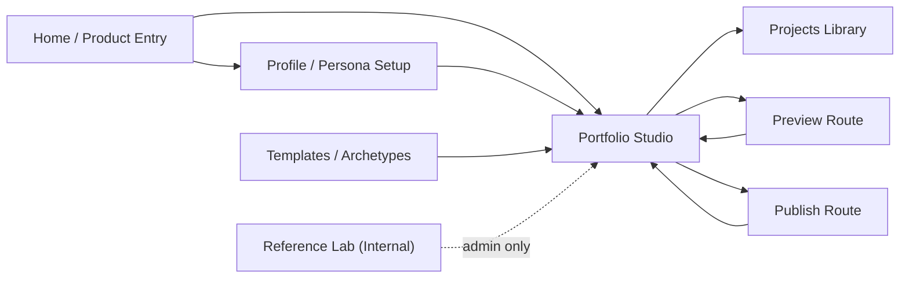
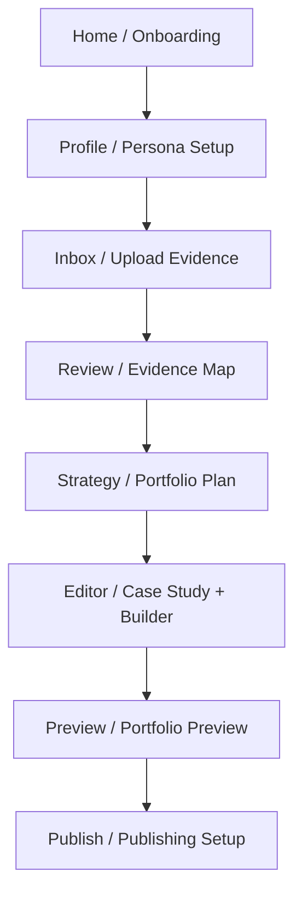
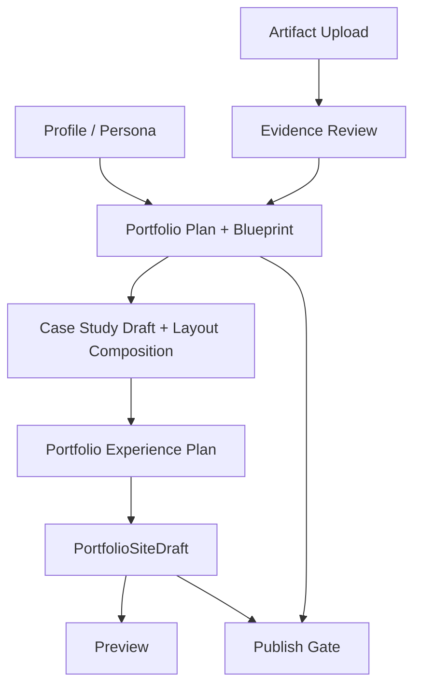

# Step 023.6 - Page Wiring & Product Flow Integrity Audit

## Status
Implemented.

## Goal
Make Auto-CaseStudy feel like one connected product rather than separate feature islands.

The audit focused on routing, page responsibility, upstream/downstream data dependencies, guardrails, and terminology consistency across the public product shell and the protected Studio workflow.

## High-Level Sitemap

## Studio Flow

## Route Map

| Route | Responsibility | Wiring State |
| --- | --- | --- |
| `/` | Public product explanation and entry | Live |
| `/profile` | Persona, identity, bio, skills, links, resume context | Added |
| `/projects` | Project library and case-study route overview | Rewired to site draft state |
| `/studio#ingest` | Upload evidence | Hash-addressable |
| `/studio#intelligence` | Evidence review, classification, graph, backlog | Hash-addressable |
| `/studio#strategy` | Portfolio plan, blueprint review, orchestration | Hash-addressable |
| `/studio#editor` | Case-study editing plus portfolio builder shell | Hash-addressable |
| `/studio#preview` | Studio preview of saved site draft | Hash-addressable |
| `/studio#export` | Publish readiness inside Studio | Hash-addressable |
| `/preview` | Clean recruiter-facing portfolio preview | Added |
| `/templates` | Archetype and design-system selection | Rewired from placeholder |
| `/publish` | Publish readiness and setup gate | Rewired from placeholder |
| `/references` | Internal reference intelligence lab | Still protected/internal |

## Data Dependency Map

## Page Responsibility Map

| Page | Owns | Does Not Own |
| --- | --- | --- |
| Home | Product promise, entry, upload CTA | Editor controls |
| Profile/About | Role target, persona, bio, skills, links, resume context | Evidence generation |
| Inbox | Upload and ingestion | Narrative generation |
| Review | Evidence records, classification, graph, backlog | Portfolio writing |
| Strategy | Portfolio plan, blueprint review, orchestration | Final publishing |
| Editor | Case-study draft, quality, revisions, layout composition, site draft editing | Public preview |
| Preview | Clean saved draft rendering | Editing controls |
| Publish | Readiness checks, export/domain/share setup surface | Bypassing blockers |
| Templates | Archetype and design-system direction | Random theme marketplace |

## Fixes Applied

1. Navigation wiring
   - Added a central product flow map in `src/lib/product-flow.ts`.
   - Rewired primary navigation to real product routes.
   - Added `/profile` and `/preview` route surfaces.
   - Replaced placeholder Projects, Templates, and Publish pages with flow-aware pages.
   - Kept `/references` as an internal/admin route rather than a primary end-user feature.

2. Studio route integrity
   - Studio sidebar/mobile tabs now sync with URL hashes.
   - `/studio#ingest`, `/studio#intelligence`, `/studio#strategy`, `/studio#editor`, `/studio#preview`, and `/studio#export` are addressable.
   - Active Studio state follows direct hash links and browser hash changes.

3. Data flow integrity
   - Profile persona updates the same store consumed by portfolio strategy.
   - Projects page reads saved `PortfolioSiteDraft` project pages.
   - Preview reads saved `PortfolioSiteDraft` and blocks clearly when missing.
   - Publish reads saved `PortfolioSiteDraft` plus generation readiness.
   - Editor shows an upstream blueprint gate before builder/generation actions.

4. Guardrails
   - Preview now says "Create a site draft first" when no draft exists.
   - Publish blocks when the site draft is missing or readiness is blocked.
   - Editor warns when the persisted blueprint is missing or blocked.
   - Publish controls remain disabled until draft and readiness conditions are met.

5. UI consistency
   - Shared workspace header helper added in `src/lib/client-workspace.ts`.
   - Preview surfaces use the saved draft model instead of local demo sections.
   - Page terminology now favors Profile, Inbox, Review, Strategy, Editor, Preview, Publish.

## Tech Stack Used

- Next.js App Router for real routes.
- React client components for workspace-aware state and API loading.
- Zustand for local persona/audience/theme continuity.
- Existing workspace session headers for API ownership context.
- `PortfolioSiteDraft` as the saved editor-to-preview contract.
- Tailwind design tokens for consistent dark studio UI.

## Security / Privacy Notes

- No public publish action was added.
- Preview and Publish read only the current workspace draft through existing workspace headers.
- Publish remains gated; it does not create hosted output.
- The Reference Lab remains internal/admin infrastructure and is not elevated into the primary user flow.
- Profile context is local MVP state; server-backed profile persistence should be added before multi-device production use.

## Broken Links Fixed

- Top-level Profile route did not exist. Added `/profile`.
- Top-level Preview route did not exist. Added `/preview`.
- Projects, Templates, and Publish were placeholders. Rewired them to product-aware surfaces.
- Studio tabs did not route. They now use addressable URL hashes.

## Remaining Placeholders

- Real authenticated profile persistence is not implemented yet.
- Publish setup is still a readiness shell, not hosted publishing.
- Templates select strategy direction but do not yet mutate a server-backed template choice.
- Projects route depends on `PortfolioSiteDraft`; without it, it intentionally shows the next action.

## QA Checklist

- [x] Fresh user sees clear missing-state guardrails.
- [x] User can route to Profile, Projects, Templates, Preview, Publish.
- [x] Studio hash navigation maps to Inbox, Review, Strategy, Editor, Preview, Publish.
- [x] Preview blocks without a saved site draft.
- [x] Publish blocks without a saved site draft or passing readiness.
- [x] Editor shows blueprint readiness context.
- [x] TypeScript compile passes.
- [x] Production build passes.
- [x] Local route smoke test passes for `/`, `/profile`, `/projects`, `/templates`, `/preview`, and `/publish`.
- [ ] Live production smoke test after deployment.
- [ ] Production schema sync for `PortfolioSiteDraft` before trusting live draft persistence.

## Failure Modes

| Failure | Expected Behavior |
| --- | --- |
| No saved draft | Preview and Projects show next action instead of breaking |
| No confirmed blueprint | Editor shows upstream gate and Strategy CTA |
| Readiness blocked | Publish disables publish setup |
| API load failure | Page shows clear error or safe missing-state copy |
| Direct `/studio#editor` visit | Studio opens the Editor view |

## Next Step Recommendations

1. Run production schema sync for `PortfolioSiteDraft`.
2. Deploy and smoke test each route on Vercel.
3. Add server-backed profile persistence after schema sync.
4. Add template selection persistence after the builder draft is stable.
5. Add publish job scaffolding only after preview and draft persistence are verified live.
