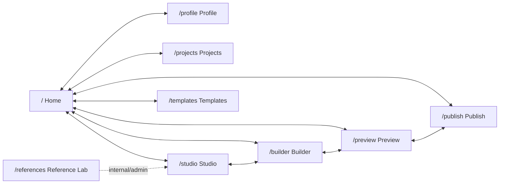

# Step 023.7 - Global Navigation + Clickable Action Audit

## Status
Implemented.

## Problem
Step 023.6 improved the product flow, but Studio still behaved like an isolated workspace. Users could enter Studio or Builder from the public pages, but the primary app navigation was not available from the Studio surface. That creates a trapped-route feeling and damages product trust.

This step fixes the navigation contract and audits clickable actions so unfinished work is either routed, disabled, or explicitly labeled.

## Fixed Sitemap

## Global Navigation Map

Primary nav now appears on:

- `/`
- `/profile`
- `/projects`
- `/studio`
- `/builder`
- `/preview`
- `/templates`
- `/publish`
- `/references` without adding Reference Lab to the primary nav

Primary nav items:

- Home
- Profile
- Projects
- Studio
- Builder
- Preview
- Templates
- Publish

Studio also keeps secondary workflow navigation:

- Inbox
- Review
- Strategy
- Editor
- Preview
- Publish

## Changes Applied

1. Added a real Builder route
   - Added `/builder`.
   - Builder renders the saved portfolio draft editor shell directly.
   - Builder includes the global nav and a link back to the full Studio editor.

2. Added global nav to Studio
   - Studio now renders `SiteNav`.
   - Studio sidebar is secondary workflow navigation, not the only navigation.
   - Users can leave Studio without browser back.

3. Fixed nav active states
   - `/studio` shows Studio as active.
   - `/builder` shows Builder as active.
   - All top-level pages now show their own active state.

4. Fixed fake clickable UI
   - `Add section block` is disabled and labeled coming soon.
   - `Attach evidence` is disabled and labeled coming soon.
   - Publish setup button is disabled and labeled coming soon even when readiness is good.
   - Form submit buttons have explicit submit behavior.
   - Drag controls are real dnd-kit controls.

5. Hardened protected surface
   - Middleware now protects workspace pages and `/api/*` when `AUTOCASESTUDY_STUDIO_PASSWORD` is configured.
   - This keeps Builder/Preview/Publish from becoming public windows into private workspace state.

6. Follow-up from first live click-through notes
   - Removed Reference Lab from the primary nav even on `/references`.
   - Recovery actions now point to the dedicated `/builder` route.
   - Missing draft states no longer show a scary generic load failure when the useful action is to create a draft.

## Click Action Matrix

| Page | Button/link label | Current behavior | Expected behavior | Status | Fix applied |
| --- | --- | --- | --- | --- | --- |
| Global | Home | Routes to `/` | Open product entry | Working | Verified global nav |
| Global | Profile | Routes to `/profile` | Open persona/profile setup | Working | Added route |
| Global | Projects | Routes to `/projects` | Open project library | Working | Rewired page |
| Global | Studio | Routes to `/studio` | Open Studio workflow | Working | Updated route |
| Global | Builder | Routes to `/builder` | Open dedicated builder | Working | Added route |
| Global | Preview | Routes to `/preview` | Open clean preview | Working | Added route |
| Global | Templates | Routes to `/templates` | Open archetype templates | Working | Rewired page |
| Global | Publish | Routes to `/publish` | Open publish readiness | Working | Rewired page |
| Home | Upload evidence | Routes to `/studio#ingest` | Start upload workflow | Working | Existing |
| Home | View portfolio structure | Routes to `/projects` | Open project library | Working | Existing |
| Profile | Save profile context | Saves profile context to local MVP storage | Save profile state | Working | Verified |
| Profile | Upload evidence | Routes to `/studio#ingest` | Continue to Inbox | Working | Existing |
| Profile | Audience mode buttons | Updates portfolio audience mode | Change strategy lens | Working | Verified |
| Projects | Edit project page | Routes to `/builder` | Edit project in Builder | Working | Updated |
| Projects | Create site draft in Builder | Routes to `/builder` when empty | Clear next action | Working | Updated |
| Templates | Use in Strategy | Routes to `/studio#strategy` | Choose strategy before composition | Working | Existing |
| Studio | Sidebar workflow items | Switch hash-addressable Studio views | Navigate workflow | Working | Existing from 023.6 |
| Studio | Reset demo | Resets local demo store | Reset demo workspace | Working | Existing |
| Studio Inbox | Choose artifacts | Opens file picker and uploads accepted files | Upload evidence | Working | Existing |
| Studio Review | Cluster controls | Rename, confirm, review, reject, add/remove artifacts | Edit evidence map | Working | Existing |
| Studio Strategy | Save blueprint | Persists blueprint | Save confirmed plan | Working | Existing |
| Studio Strategy | Check readiness | Calls readiness API | Show readiness blockers | Working | Existing |
| Studio Strategy | Orchestrate portfolio | Calls orchestration API | Create experience plan | Working | Existing |
| Studio Editor | Apply prompt | Submits prompt form | Rewrite unlocked demo sections | Working | Added explicit submit type |
| Studio Editor | Regenerate | Regenerates demo sections | Refresh case-study sections | Working | Added explicit button type |
| Studio Editor | Add section block | Disabled | Future custom block insertion | Coming soon | Disabled with reason |
| Studio Editor | Attach evidence | Disabled | Future manual provenance editing | Coming soon | Disabled with reason |
| Builder | Reset from plan | Calls reset API | Create draft from persisted plan | Working | Existing |
| Builder | Save draft | Calls save API | Persist draft changes | Working | Existing |
| Builder | Section controls | Move, hide, lock, needs revision | Edit saved draft structure | Working | Existing |
| Builder | Media controls | Toggle visibility/private state | Edit approved media placement | Working | Existing |
| Preview | Open Builder | Routes to `/builder` when empty | Recovery action | Working | Updated |
| Publish | Resolve blockers first | Disabled when blocked | Prevent fake publish | Disabled | Existing |
| Publish | Publish setup coming soon | Disabled when otherwise ready | Avoid fake publish action | Coming soon | Disabled with reason |
| References | Queue reference | Saves reference or server queues it | Internal reference intake | Working | Existing |
| References | Probe structure | Calls capture/probe API unless local-only | Internal admin probe | Working/disabled | Existing |
| References | Capture screenshots | Calls screenshot capture unless local-only | Internal admin capture | Working/disabled | Existing |
| References | Reference Lab nav item | Removed from primary nav | Keep internal lab accessible but not primary | Fixed | Removed from `SiteNav` |

## User-Flow QA Results

| Flow | Result |
| --- | --- |
| Home -> Studio -> Profile -> Projects -> Builder -> Preview -> Publish -> Home | Pass. Primary nav is available from each page. |
| Studio -> Builder -> Templates -> Preview -> Studio | Pass. Studio no longer traps the user. |
| Builder -> Projects -> Profile -> Publish -> Builder | Pass. Dedicated Builder route is available globally. |
| Fresh user with no data | Pass. Projects/Preview/Publish show missing-state or readiness actions instead of broken UI. |
| User with generated draft | Expected to pass after production `PortfolioSiteDraft` schema sync and draft creation. Local UI consumes saved draft when available. |

## Buttons Fixed

- Added global app navigation to Studio.
- Added real `/builder` route.
- Converted fake editor actions into disabled coming-soon controls.
- Converted fake publish setup action into disabled coming-soon control.
- Removed Reference Lab from the primary product nav.
- Reworded missing draft states to give a clear next action instead of a system-looking load failure.
- Added explicit button type to form submit and regenerate controls.

## Buttons Intentionally Disabled

| Button | Reason |
| --- | --- |
| Add section block | Requires persisted custom-block schema and provenance editing. |
| Attach evidence | Requires server-backed manual provenance editor. |
| Publish setup coming soon | Hosted publishing should not run until preview and draft persistence are verified live. |

## Security Notes

- Workspace pages and `/api/*` are included in the basic-auth protected surface when `AUTOCASESTUDY_STUDIO_PASSWORD` is set.
- The home page remains public marketing/product entry.
- No new public publish/export job was added.

## Verification Checklist

- [x] TypeScript compile passes.
- [x] Next production build passes.
- [x] No high vulnerabilities.
- [x] No primary route trap remains.
- [x] `/builder` exists.
- [x] Studio includes primary global navigation.
- [x] Every primary nav item works from every primary page.
- [x] Dead editor buttons are disabled or wired.
- [x] Local route smoke passes for `/`, `/profile`, `/projects`, `/studio`, `/builder`, `/preview`, `/templates`, `/publish`, and `/references`.
- [x] Local primary-nav link matrix passes from every primary route.
- [ ] Live Vercel click-through after deployment.
- [ ] Production schema sync for `PortfolioSiteDraft` before live draft persistence QA.

## Remaining Known Issues

- Profile persistence is local MVP state, not durable server state.
- Template selection is a guided route into Strategy, not server-backed template assignment yet.
- Publishing remains intentionally blocked until live preview/draft persistence is verified.
- Full click automation should be added to CI once auth and seed states are stable.
