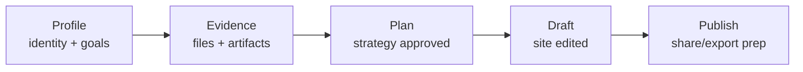

# Step 023.9 - Product UX Coherence + Language Simplification Pass

## Status
Implemented.

## Goal
Move the product surface from exposed AI infrastructure language toward a premium portfolio creation experience.

The user should feel:

> I am building a professional portfolio.

Not:

> I am operating an AI orchestration pipeline.

## UX Philosophy

### Before
- The interface exposed architecture terms such as blueprint, readiness gate, orchestration, persisted state, and PortfolioSiteDraft.
- Studio and Builder sounded like overlapping technical surfaces.
- Empty states often described missing infrastructure instead of the next meaningful portfolio action.
- Templates felt close to a generic preview/theme page.

### After
- User-facing language now centers on portfolio plan, portfolio draft, source links, project story, page layout, and issues to resolve.
- Studio is framed as the AI workspace for upload, review, strategy, generation, and revision.
- Builder is framed as the website editor for pages, content, evidence, quality, theme, and responsive preview.
- Templates are framed as portfolio archetype systems that guide structure and storytelling.
- Global progress shows the current portfolio journey.

## High-Level Map

## Terminology Replacements

| Internal Language | Product Language |
| --- | --- |
| persisted blueprint | saved portfolio plan |
| confirmed blueprint | approved portfolio plan |
| generation readiness gate | portfolio issue check |
| PortfolioSiteDraft | portfolio draft |
| orchestration | portfolio flow |
| provenance references | source links |
| upstream state | next step needed |
| generation blockers | issues to resolve |
| case study draft workspace | project story |
| layout composition | page layout |
| guardrails | portfolio checks |

## Navigation Restructuring

Primary navigation remains:

- Home
- Profile
- Projects
- Studio
- Builder
- Preview
- Templates
- Publish

Reference Lab remains internal and is not shown in the primary nav.

## Builder IA Changes

Builder now presents explicit editing modes:

- Pages: choose Home or project pages and inspect page structure.
- Content: edit headlines, sections, captions, and CTA copy.
- Evidence: keep source links visible.
- Quality: track warnings and revision needs.
- Theme: tune typography, spacing, color mood, appearance, buttons, and responsive preview.

This does not change the underlying evidence-backed draft contract. It changes the mental model so the user sees a website editor instead of a systems console.

## Templates Redesign Direction

Templates now represent portfolio systems, not random skins:

- UX Research
- Product Design
- Technical UX Hybrid
- Recruiter Clean

Each template describes:

- audience fit
- storytelling emphasis
- page rhythm
- strategy entry point

Future work should persist template choice into Strategy and Builder.

## Progress-System Strategy

The global progress strip tracks:

- Profile
- Evidence
- Plan
- Draft
- Publish

The progress system uses available local/store state plus safe server checks for saved draft and portfolio issue state. It is intentionally simple, visible, and action-oriented.

## Emotional Design Goals

- Calm surface, powerful background.
- Career-oriented language before system language.
- One next meaningful action per blocked state.
- Source trust remains visible without making the UI feel academic or bureaucratic.
- Builder feels like a portfolio website editor.
- Studio feels like the AI preparation space.

## Cognitive-Load Reductions

- Removed user-facing references to PortfolioSiteDraft, persisted blueprint, readiness gate, and orchestration.
- Rewrote missing-state copy to point to the next action.
- Moved Builder into explicit regions instead of one overloaded panel.
- Reframed Preview as recruiter-facing review.
- Reframed Publish as a clear checklist.
- Reframed Templates around archetypes and story rhythm.

## QA Checklist

- [x] Primary nav remains available on every top-level route.
- [x] Reference Lab is not shown in primary navigation.
- [x] Builder shows Pages, Content, Evidence, Quality, and Theme modes.
- [x] Templates page has a clear portfolio archetype identity.
- [x] Preview empty state uses product language.
- [x] Publish empty state uses product language.
- [x] Internal architecture terms are removed from normal page copy.
- [x] Global progress strip renders.
- [ ] Production visual QA after deployment.

## Remaining UX Debt

- Studio still contains dense expert panels because the product is mid-build; future passes should progressively reveal advanced review and quality tools.
- The global progress strip is MVP-level and should later be backed by a dedicated progress endpoint.
- Template selection routes into Strategy but does not yet persist the selected archetype as a first-class user decision.
- Preview needs richer portfolio visuals once the Builder can persist media-heavy site drafts.
- Publish remains intentionally disabled until hosted publishing is implemented.

## What Comes Next

Step 024 should not add another backend engine. The next product-facing work should improve one of:

- saved template selection
- richer portfolio preview fidelity
- Builder media editing
- Studio progressive disclosure
- production visual QA across desktop and mobile
