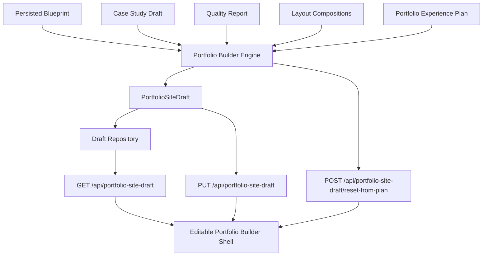
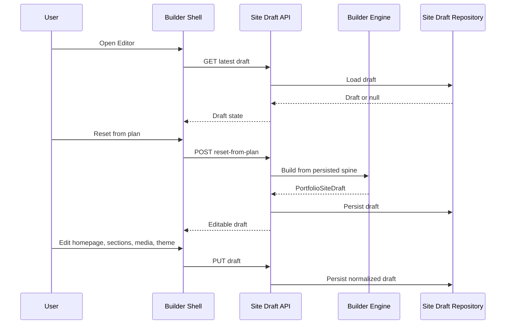

# Step 023 - Editable Portfolio Builder Shell

## Goal

Create the first real editable portfolio-builder surface that consumes persisted orchestration, layout composition, case study draft, blueprint, and provenance state.

This step is not publishing. It creates an editable draft shell for future portfolio assembly.

## Architecture Diagram

## Builder Flow

## State Model

New persisted object:

`PortfolioSiteDraft`

Stores:

- homepage hero, subtitle, proof blocks, featured project, and CTAs
- navigation structure
- project pages
- section order, titles, visibility, lock state, and revision flags
- media assignments, captions, placement, visibility, and privacy
- theme settings
- responsive preview device
- provenance references
- builder guardrails

## Persistence Flow

- `GET /api/portfolio-site-draft` loads the latest workspace draft.
- `PUT /api/portfolio-site-draft` validates workspace ownership and saves normalized draft state.
- `POST /api/portfolio-site-draft/reset-from-plan` rebuilds the draft from the latest persisted plan/compositions.
- `PortfolioSiteDraft` is stored in the database when `DATABASE_URL` exists.
- Local development falls back to `.data/portfolio-site-drafts.json`.

## Provenance Handling

The builder never removes provenance silently.

- Homepage keeps provenance from the experience plan or blueprint.
- Project sections inherit provenance from layout composition regions.
- Media assignments inherit provenance from approved media placements.
- Visible badges show source counts and warning counts.
- Rejected visuals are not reintroduced because reset consumes approved composed media only.

## Responsive Preview Model

The first shell supports:

- desktop preview
- tablet preview
- mobile preview

This is currently a layout-width preview, not final browser rendering. Final visual QA belongs to the later publishing/preview pipeline.

## UI Surface

The Editor view now includes:

- left builder navigator
- homepage editor shell
- project page editor shell
- section controls
- media controls
- right settings panel
- responsive device switcher
- theme controls
- save/reset state
- provenance badges

## Guardrails

The builder does not:

- publish anything
- invent unsupported claims
- load rejected visuals
- hide provenance
- bypass the persisted orchestration plan
- bypass the confirmed blueprint

## QA Checklist

- [x] Prisma schema validates.
- [x] TypeScript compile passes.
- [x] Next production build passes.
- [x] Security audit reports no high vulnerabilities.
- [ ] Builder loads existing persisted draft.
- [ ] Reset from plan creates draft from persisted orchestration state.
- [ ] Homepage edits persist.
- [ ] Project section order persists.
- [ ] Section visibility toggles persist.
- [ ] Section lock/revision flags persist.
- [ ] Media captions and placements persist.
- [ ] Theme settings persist.
- [ ] Responsive device selection persists.
- [ ] Provenance badges remain visible.

## Failure Modes

- No experience plan: draft is created with a guardrail warning.
- No composed pages: project canvas shows no composed project sections.
- Missing approved visuals: media panel shows an empty-state warning.
- Invalid draft payload: API returns `422`.
- Cross-workspace draft payload: API rejects it.
- Database unavailable locally: repository falls back to `.data`.

## What Comes Next

1. Sync production schema for `PortfolioSiteDraft`.
2. Run live production QA for reset, save, refresh, section reorder, media edit, and theme persistence.
3. Connect Preview to the saved `PortfolioSiteDraft`.
4. Add richer visual editing controls for spacing, page sections, and media blocks.
5. Build publish assembly later from saved draft, not from temporary UI state.
