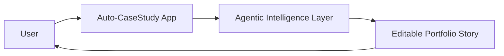

# Step Title

## High-Level Map



## Tech Stack Used

- Frontend:
- State:
- Data/parsing:
- Agent/AI:
- Deployment:

## What Each Part Does

- Part 1:
- Part 2:
- Part 3:

## How To Reproduce It

```bash
npm install
npm run build
npm run dev
```

Open `http://localhost:3000`.

## Security / Privacy Notes

- File/data exposure risk:
- Authentication or access-control impact:
- Environment variables or secrets touched:
- Failure/abuse case considered:

## QA Checklist

- Build passes:
- Main happy path tested:
- Empty/loading/error states tested:
- Broken/dead buttons checked:
- Mobile/responsive behavior checked:
- Accessibility basics checked:

## Feasibility Notes

- Data required:
- Storage location:
- Failure behavior:
- MVP necessity:

## What Comes Next

- Next improvement:
- Known limitation:
- Decision needed:
