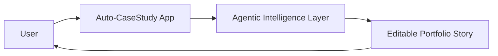

# Step Title

## High-Level Map



## Tech Stack Used

- Frontend:
- State:
- Data/parsing:
- Agent/AI:
- Deployment:

## What Each Part Does

- Part 1:
- Part 2:
- Part 3:

## How To Reproduce It

```bash
npm install
npm run build
npm run dev
```

Open `http://localhost:3000`.

## What Comes Next

- Next improvement:
- Known limitation:
- Decision needed:
