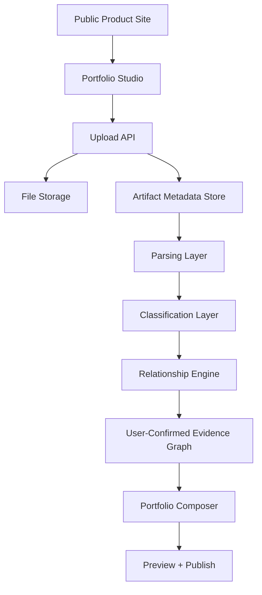

# Technical Requirements Document: Auto-CaseStudy

## System Architecture

## Frontend Architecture

- Framework: Next.js App Router with TypeScript.
- Styling: Tailwind CSS with local design tokens.
- State: Zustand for MVP client state and local persistence.
- Routing:
  - `/`: public product site.
  - `/studio`: portfolio creation studio.
  - `/projects`: project library skeleton.
  - `/templates`: template skeleton.
  - `/publish`: publishing skeleton.
- Interaction libraries: dnd-kit for editable/reorderable sections.
- Icons: lucide-react.

## Backend Architecture

- Current: Next.js route handlers for API endpoints.
- Future: service boundary can move long-running parsing/AI jobs to FastAPI or queued workers.
- Current APIs:
  - `GET /api/artifacts`: list artifacts and merged evidence map.
  - `POST /api/artifacts`: upload, store, parse, classify, and map artifacts.
  - `PATCH /api/evidence-map`: persist user-reviewed cluster decisions.

## API Strategy

- Keep API responses structured and typed.
- Avoid long-running synchronous work after MVP; move parsing and AI work to jobs.
- API errors must return actionable messages.
- Future endpoints should separate artifacts, projects, portfolios, publishing, and auth.

## Event Architecture

MVP uses synchronous API-triggered processing.

Future events:
- `artifact.uploaded`
- `artifact.parsing.started`
- `artifact.parsed`
- `artifact.classified`
- `cluster.suggested`
- `cluster.confirmed`
- `portfolio.generated`
- `portfolio.published`
- `claim.source_missing`

## Infrastructure Decisions

- Frontend and API hosted on Vercel.
- Current local fallback: `.data` JSON and local uploads.
- Production file storage: Vercel Blob or S3.
- Production database: PostgreSQL with Prisma or Drizzle.
- Background jobs: Vercel queues/background jobs, Inngest, Trigger.dev, or a FastAPI worker queue.

## Authentication Flow

MVP has no real auth.

Future auth requirements:
- Sign up/login with email and OAuth.
- User owns portfolios, artifacts, and publishing settings.
- Organization/team access for institutions or mentors.
- Session-protected studio routes.
- Public published portfolios separated from private studio data.

## Security Requirements

- Never expose raw storage credentials to the client.
- Validate file types and size limits before storage.
- Scan or sandbox untrusted documents where feasible.
- Use signed upload/read URLs for private files.
- Enforce user ownership on all artifact, project, and portfolio records.
- Preserve audit events for AI-generated content and user overrides.
- Do not generate unsupported claims without source references.

## Deployment Strategy

- GitHub is the source of truth.
- Vercel production deploys from `main`.
- Preview deployments should run for pull requests when secrets are configured.
- Build command: `npm run build`.
- Node target: project package declares Node 20.x.
- Deployment verification must include content checks on the live production URL.

## Service Boundaries

- Public Site: marketing and product education.
- Studio UI: authenticated creator interface.
- Artifact Service: file metadata, storage, extraction status.
- Parsing Service: raw content extraction.
- Intelligence Service: classification, relationship mapping, future AI orchestration.
- Portfolio Service: site/page/project/case-study composition.
- Publishing Service: hosted output, domains, exports, SEO/social metadata.

## Observability and Logging

MVP:
- Build output and local console logs.
- API errors surfaced to UI.

Future:
- Structured logs for upload, parsing, classification, generation, publish.
- Job status dashboard.
- Error tracking with request/user/workspace context.
- Audit trail for AI suggestions, user overrides, source links, and publish events.
- Metrics for upload success, parse failure, time to first draft, publish completion.
