# Canonical Persona Packs

These packs are synthetic validation fixtures for Auto-CaseStudy. They are not user data and they are not model-training data.

Their purpose is to stress test the evidence-first product spine:

```mermaid
flowchart LR
  A["Blank user"] --> B["Profile context"]
  B --> C["Messy evidence"]
  C --> D["Parsing + classification"]
  D --> E["Evidence graph"]
  E --> F["Portfolio plan"]
  F --> G["Confirmed blueprint"]
  G --> H["Case study draft"]
  H --> I["Quality + revision"]
  I --> J["Layout + portfolio draft"]
```

The live validation API runs these packs through the current local engines:

- `/api/persona-validation`
- `/api/persona-validation?persona=technical-ux-hybrid`

The goal is truth, not demo polish. Weak evidence should remain weak, blockers should remain visible, and unsupported claims should not become finished portfolio copy.
